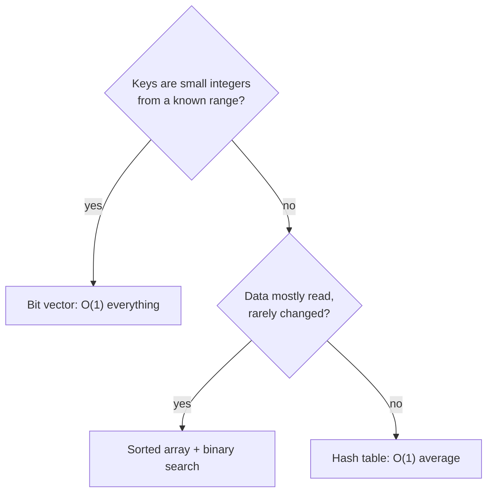

> [!goal] By the end of this note you can
> - Define the Dictionary ADT and its operations exactly as your handout does.
> - Explain how "dictionary as a set of keys" connects to "dictionary as key → value".
> - Compare the simple implementations (list, sorted array, bit vector) and say why hashing exists.

## Definition

Your handout: a **dictionary** is an ADT based on a set, with the operations

| Operation | Does |
|---|---|
| `insert(x, A)` | adds x to A, **if x ∉ A** |
| `delete(x, A)` | removes x from A, if x ∈ A |
| `member(x, A)` | true (non-zero) if x ∈ A, otherwise false (zero) |

plus the utilities `initialize(A)` (make A empty for the first time) and `makenull(A)` (empty an existing A).

That's it. No union, no intersection, no "give me the smallest". A dictionary only answers **"is it here?"** and lets you add and remove things. Dropping the other operations is what makes it possible to answer that one question extremely fast.

## Keys and values

In real programs you rarely store a bare key. You store a **record identified by a key**:

| Dictionary | Key | Value (the rest of the record) |
|---|---|---|
| Student records | ID number `2023-00123` | name, course, year |
| Phone book | name | phone number |
| Spell checker | word | nothing: the key *is* the data |
| Compiler symbol table | variable name | type, memory address |

The ADT stays the same. `member` looks up by key, and the element simply carries extra fields. In C that's a struct:

```c
typedef struct {
    char id[12];     /* the key: unique */
    char name[40];   /* the value part  */
    int  year;
} Student;
```

## Simple implementations and their costs

With n elements:

| Implementation | member | insert | delete | Notes |
|---|---|---|---|---|
| Unsorted array / linked list | O(n) | O(n)* | O(n) | *must check for duplicates first |
| Sorted array | **O(log n)** | O(n) | O(n) | binary search finds; shifting inserts |
| Sorted linked list | O(n) | O(n) | O(n) | can stop early, but no binary search |
| Bit vector (keys = small ints) | **O(1)** | **O(1)** | **O(1)** | memory = size of the universe |
| **Hash table** | **O(1) average** | **O(1) average** | **O(1) average** | O(n) worst case |

The bit vector is perfect but only works for small integer keys. The sorted array gives fast lookups but slow updates. **Hashing** aims for bit-vector speed with list-like memory. The rest of this track builds it up.

## A sorted-array dictionary's `member`: binary search

Binary search is the reason a sorted array beats a list for lookups. It was introduced in [[Big-O and Complexity]]. Here it is on string keys, which is how dictionaries are usually keyed:

```c title="lookup.c"
#include <stdio.h>
#include <string.h>

/* words[] must be sorted by strcmp order. Returns index or -1. O(log n). */
int findWord(const char *words[], int n, const char *key) {
    int lo = 0, hi = n - 1;
    while (lo <= hi) {
        int mid = lo + (hi - lo) / 2;
        int cmp = strcmp(key, words[mid]);
        if (cmp == 0) return mid;
        if (cmp < 0)  hi = mid - 1;   /* key sorts before words[mid] */
        else          lo = mid + 1;
    }
    return -1;
}

int main(void) {
    const char *reserved[] = {"break", "case", "char", "else", "for",
                              "if", "int", "return", "struct", "while"};
    int n = sizeof reserved / sizeof reserved[0];
    printf("%d\n", findWord(reserved, n, "return"));   /* 7  */
    printf("%d\n", findWord(reserved, n, "union"));    /* -1 */
    return 0;
}
```

Ten keywords take at most 4 comparisons. A million would take about 20. But inserting a new word keeps the array sorted by shifting everything after it, which is O(n). That's fine for data that rarely changes, like a list of language keywords, and bad for data that changes constantly.

## Choosing an implementation



## The idea behind hashing (preview)

What if we could compute *where* a key lives from the key itself, like a bit vector does, without needing a slot for every possible key?

A **hash function** turns any key into a small number: its bucket or slot. Your handout puts it precisely. The hash value gives either

1. the **exact location** of the element, or
2. the **starting location** for the search.

Those two cases are the two families of hashing:

| | Open hashing (external) | Closed hashing (internal) |
|---|---|---|
| Storage | array of **lists**; potentially unlimited | **one fixed array**; limits the set's size |
| Hash value gives | the group (list) the element belongs to | the exact slot, or where to start probing |
| Note | [[Open Hashing]] | [[Closed Hashing]] |

## Practice

**Basic.** Which operations does a dictionary *not* support that the ADT UID set does? Why does leaving them out help?

> [!answer]- Answer
> Union, intersection and difference. Without them there's no need to walk elements in any order or combine whole sets, so the structure can scatter elements wherever makes lookups fastest. That's exactly what hashing does.

**Intermediate.** You store 50,000 product codes that change every few minutes. Sorted array or hash table? What if the codes are integers 0–99?

> [!answer]- Answer
> Frequent updates rule out the sorted array (O(n) insert and delete), so use a hash table. If codes are only 0–99, a 100-slot bit vector (or boolean array) beats both: O(1) everything and only 100 slots.

**Advanced.** Binary search needs `lo + (hi - lo) / 2` instead of `(lo + hi) / 2`. When does the simpler version break?

> [!answer]- Answer
> When `lo + hi` exceeds `INT_MAX`: arrays with more than about a billion elements. The sum overflows (undefined behaviour for signed int) and `mid` can go negative. `hi - lo` never overflows when both are valid indices.

## Next

Everything in hashing depends on one function: [[Hash Functions]].

## References

- Course handout: *Topics: Dictionary and Hashing* (definition, implementations, two types of hashing)
- Aho, Hopcroft & Ullman, *Data Structures and Algorithms*, §4.7–4.8 (dictionaries, hash tables)
- [Associative array (Wikipedia)](https://en.wikipedia.org/wiki/Associative_array)
