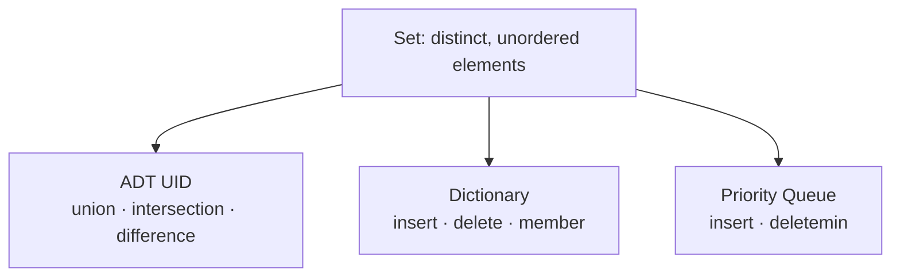

> [!goal] By the end of this note you can
> - State the two properties that make a set different from a list.
> - Compute union, intersection, difference and symmetric difference by hand.
> - Explain what "ADT UID" means in your handouts and which ADTs are built on sets.
> - Write the C interface (prototypes) for a set ADT.

## Definition

Your handout quotes Aho, Hopcroft & Ullman: a set is a collection of members, where each member is either an *atom* (a primitive element such as an integer) or itself a set. **All members are different.** No set contains two copies of the same element.

We write sets with braces: `{3, 1, 5}` has the members 1, 3 and 5.

## Set vs list: the two differences that matter

| | List | Set |
|---|---|---|
| **Order** | significant: `[3, 1, 5] ≠ [1, 3, 5]` | irrelevant: `{3, 1, 5} = {1, 3, 5}` |
| **Duplicates** | allowed: `[4, 4, 7]` is fine | not allowed: `{4, 4, 7}` is just `{4, 7}` |
| Typical question | "what's at position 3?" | "is 7 a member?" |

A set **can be stored** exactly like a list (array, linked list, cursor-based). The difference is in the rules the operations enforce. `insert` must refuse duplicates, and no operation may depend on position.

> [!tip] Keeping a set sorted is allowed
> Order doesn't *matter* to a set, but you may still *store* elements in sorted order as an implementation choice. Sorted storage is what makes fast union and intersection possible in [[List-Based Sets]].

## The operations

Using A = {1, 4, 6, 9} and B = {2, 4, 9, 10}:

| Operation | Math | Meaning | Result |
|---|---|---|---|
| Union | A ∪ B | in A **or** B | {1, 2, 4, 6, 9, 10} |
| Intersection | A ∩ B | in A **and** B | {4, 9} |
| Difference | A − B | in A **but not** B | {1, 6} |
| Difference | B − A | in B but not A | {2, 10} |
| Symmetric difference | A △ B | in exactly one of them | {1, 2, 6, 10} |
| Member | x ∈ A | is x in A? | 6 ∈ A true, 2 ∈ A false |

Difference is **not** symmetric: A − B ≠ B − A. And |A ∪ B| = |A| + |B| − |A ∩ B|, which is a quick way to check your answers: 4 + 4 − 2 = 6 ✓.

Plus the maintenance operations: `initialize(A)`, `makenull(A)`, `insert(x, A)`, `delete(x, A)`.

## "ADT UID" and the ADTs built on sets

Your handout names the set ADT with **U**nion, **I**ntersection and **D**ifference **"ADT UID"**, and lists three ADTs based on sets:



Each one keeps only the operations it needs, and that choice changes which implementation is best:

- **UID** needs fast whole-set operations → bit vectors or sorted lists.
- **Dictionary** needs fast single-element lookups → hashing ([[ADT Dictionary]]).
- **Priority Queue** needs fast "give me the smallest" → partially ordered trees ([[ADT Priority Queue]]).

## The universal set

Every set in a problem draws from a **universe U** of possible elements. If the elements are small integers, say U = {0, 1, …, 7}, you can give every possible element its own slot. That's the idea behind the [[Bit-Vector Sets]]:


The size of U, not the size of the set, decides how much memory that costs.

## A C interface

Here's what a set ADT looks like as prototypes only. The `Set` type is left abstract on purpose, because the next three notes each define it differently.

```c title="set.h"
typedef /* depends on the implementation */ Set;
typedef enum { FALSE, TRUE } boolean;

void    initialize(Set *A);                 /* A becomes {}            */
void    insert(Set *A, int x);              /* A = A ∪ {x}             */
void    delete(Set *A, int x);              /* A = A − {x}             */
boolean member(Set A, int x);               /* x ∈ A ?                 */
Set     setUnion(Set A, Set B);             /* A ∪ B                   */
Set     setIntersection(Set A, Set B);      /* A ∩ B                   */
Set     setDifference(Set A, Set B);        /* A − B                   */
void    display(Set A);                     /* prints {…}              */
```

> [!note] Why `setUnion` and not `union`?
> `union` is a C keyword, the same `union` as in `union { int i; float f; }`. Your ADT Guide writes `union(A, B)` in its tables, but a real C compiler rejects a function named `union`. Pick another name (`setUnion`, `unionSet`, …) when you implement it.

## Practice

**Basic.** Let A = {0, 3, 5, 7} and B = {1, 3, 7, 8} (universe {0 … 9}).

1. A ∪ B  2. A ∩ B  3. A − B  4. B − A  5. the complement of A (everything in U not in A)

> [!answer]- Answers
> 1. {0, 1, 3, 5, 7, 8}  2. {3, 7}  3. {0, 5}  4. {1, 8}  5. {1, 2, 4, 6, 8, 9}

**Intermediate.** Which of these problems want a *set* and which want a *list*?
(a) the order students arrived in class, (b) which students attended at least once this week, (c) the top-3 scores in order, (d) the tags on a note.

> [!answer]- Answers
> (a) list, since order matters. (b) set: "attended" is membership and duplicates are meaningless. (c) list, or a priority queue. (d) set: no duplicate tags, order irrelevant.

**Advanced.** Show that A − B = A ∩ (complement of B). Then explain why that identity matters for bit vectors.

> [!answer]- Answer
> x ∈ A − B ⇔ x ∈ A and x ∉ B ⇔ x ∈ A and x ∈ complement(B) ⇔ x ∈ A ∩ complement(B). With bits, complement is `~` and intersection is `&`, so difference becomes `A & ~B`: one instruction. You'll use this in [[Bit-Vector Sets]].

## Next

Start with the implementation you already know how to build: [[List-Based Sets]].

## References

- Course handout: *ADT Set and Bit-Vector* (definition, ADT UID, ADTs based on set)
- Aho, Hopcroft & Ullman, *Data Structures and Algorithms*, ch. 4 (Basic Operations on Sets)
- [Set (abstract data type) (Wikipedia)](https://en.wikipedia.org/wiki/Set_(abstract_data_type))
