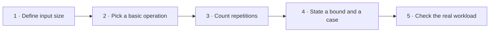
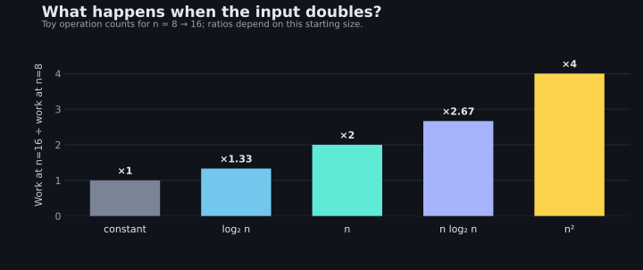

> [!goal] After this lesson
> You can choose an input size, count basic operations, derive a useful Big-O bound, separate best/average/worst cases, and compare time against memory and implementation effort.

## 1. Decide what `n` means

At a help desk, imagine searching a list of ticket IDs. Here `n` is the **number of IDs**. For a bit-vector set, two sizes matter: `s` = members actually present; `U` = possible IDs in the universe. For a graph, we may need both vertices `V` and edges `E`. **Name the size before naming the complexity.**

Aho, Hopcroft, and Ullman start with the input, the compiler/machine, and the algorithm as separate influences on measured running time (Chapter 1 §1.4, PDF pp. 18–20). Big-O describes how a chosen *model of work* grows, not seconds on one laptop.



For a linear search, the basic operation can be `a[i] == target`. Count comparisons, then ask which inputs place the target early, late, or not at all.

## 2. Count one concrete trace

Suppose the IDs are `[12, 20, 31, 44, 55]` and the query is `44`.

| Attempt | Position checked | Comparison | Stop? |
|---:|---:|---|---|
| 1 | 0 | `12 == 44` → false | No |
| 2 | 1 | `20 == 44` → false | No |
| 3 | 2 | `31 == 44` → false | No |
| 4 | 3 | `44 == 44` → true | Yes |

That run used four comparisons. If the query were `12`, it would use one. If the query were missing, it would use five. **One trace is evidence about one input, not a complexity proof.**

```c title="ticket_search.c"
#include <stddef.h>

/* Returns index or n if absent. No sorting requirement. */
size_t find_ticket(const int *a, size_t n, int target) {
    for (size_t i = 0; i < n; ++i)
        if (a[i] == target) return i;
    return n;
}
```

For any array of length `n`, the loop compares at most `n` elements. Its worst-case time is **O(n)**, and because a missing ticket forces all `n` comparisons, the worst case is also **Ω(n)** in the usual lower-bound sense. Thus the worst case is **Θ(n)**. The best case is Θ(1). The function uses Θ(1) **auxiliary** space because it allocates no storage proportional to `n`.

> [!note] What “average” requires
> An average needs a probability model. If successful queries are equally likely to refer to any of the `n` positions, the expected comparisons are `(n+1)/2`, which is Θ(n). If recent tickets are far more likely and kept at the front, the real average changes. Aho cautions that “all inputs equally likely” is often an unjustified assumption (§1.4, PDF p. 20).

## 3. What Big-O actually promises

`T(n) = O(g(n))` means that **for sufficiently large `n`**, some positive constant `c` makes `T(n) ≤ c·g(n)`. It is an **upper bound**. It is not an exact stopwatch reading or necessarily the tightest possible description.

For example, if `T(n) = 3n² + 2n + 7`, then for `n ≥ 1`:

```text
3n² + 2n + 7 ≤ 3n² + 2n² + 7n² = 12n²
```

So `T(n) = O(n²)`. It is also O(n³), but that weaker bound hides useful information. This is the same bounding move Aho demonstrates in §1.4 (PDF pp. 20–21).

**Common shorthand:** drop constant factors and lower-order terms only *after* you know what was counted. `2n + 7` has linear growth; `4n² + n` has quadratic growth. These rules assume the individual operation costs used in the model are bounded independently of `n`.

> [!warning] Avoid a misleading shortcut
> “Arithmetic is O(1)” assumes fixed-width machine values. It does not apply unchanged to integers with arbitrarily many digits, disk operations, or a function call that scans an array. Look inside the loop body.

## 4. Read code from the inside out

### Sequential loops add

```c
for (size_t i = 0; i < n; ++i) inspect(a[i]);
for (size_t i = 0; i < n; ++i) print_id(a[i]);
```

If both called operations are O(1), this is `n + n = 2n`, hence O(n). Aho's sum rule says a fixed sequence is bounded by its most expensive step (§1.5, PDF pp. 23–24).

### Nested loops multiply, but count their real lengths

```c title="pairs.c"
#include <stddef.h>

size_t equal_pairs(const int *a, size_t n) {
    size_t pairs = 0;
    for (size_t i = 0; i < n; ++i)
        for (size_t j = i + 1; j < n; ++j)
            if (a[i] == a[j]) ++pairs;
    return pairs;
}
```

For `n = 4`, the inner comparison counts by row are **3 + 2 + 1 + 0 = 6**:

```text
          j=0  j=1  j=2  j=3
    i=0    ·    ×    ×    ×
    i=1    ·    ·    ×    ×
    i=2    ·    ·    ·    ×
    i=3    ·    ·    ·    ·
```

In general the sum is `n(n−1)/2`; O(n²) and Θ(n²) for this comparison count. The triangular shape matters: “two loops” alone does not prove O(n²). Aho's bubble-sort analysis uses the same inside-out counting pattern (§1.5, PDF pp. 24–26).

### Halving gives a logarithm

When each step cuts the remaining candidates roughly in half, the sizes go `n, n/2, n/4, …, 1`. After `k` steps `n/2^k ≈ 1`, so `k ≈ log₂ n`. A binary search can be O(log n) **only if the array is sorted and random access is available**. Sorting first has its own cost; do not quietly exclude it from a one-off task.

## 5. Watch growth by doubling the input

These are **illustrative operation counts**, not measured seconds. Each column uses the simplest representative function (`1`, `log₂ n`, `n`, `n log₂ n`, `n²`).

| `n` | constant | log₂ n | n | n log₂ n | n² |
|---:|---:|---:|---:|---:|---:|
| 8 | 1 | 3 | 8 | 24 | 64 |
| 16 | 1 | 4 | 16 | 64 | 256 |
| 32 | 1 | 5 | 32 | 160 | 1,024 |



Before reading the next line, predict which bar would grow the *most* if you doubled from 16 to 32. The quadratic bar remains ×4; the logarithmic multiplier becomes `5/4 = 1.25`, illustrating that a growth *class* is not one fixed multiplier at every size.

Doubling `n` roughly doubles a linear count but quadruples a quadratic one. Aho also points out that **constants, expected input sizes, programmer time, memory, and maintainability** can outweigh the asymptotic winner for small workloads (§§1.4–1.5, PDF pp. 21–23).

> [!example] Real decision: a one-time campus roster lookup
> For 30 entries queried once, a simple linear scan may be the best engineering choice. Sorting first to run a binary search adds work and a sortedness requirement. For a million fixed entries queried thousands of times, an index becomes worthwhile. To decide, count *build cost + number of queries × cost per query*.

## 6. Space is part of the decision

For a set with `s` present IDs from a universe of `U` possible IDs:

| Representation | Rough storage growth | A question to ask |
|---|---|---|
| Linked list | O(s) nodes | How expensive is membership testing? |
| Boolean array | O(U) cells | Is `U` small and known? |
| Packed bit vector | O(U) bits | Are IDs compact integers or mappable to them? |

If five users have IDs drawn from `0..9,999,999`, a bit per possible ID takes `10,000,000 / 8 = 1,250,000` bytes (about 1.19 MiB), even when the set is empty. Aho contrasts space proportional to the universal set with space proportional to present members in Chapter 4 §§4.3–4.4 (PDF pp. 142–143). This estimate excludes metadata and alignment.

## 7. Think like an algorithm designer

For any new function, write down four lines *before* saying “O(n)”:

1. **Size:** what exactly is `n` (or `U`, `V`, `E`)?
2. **Operation:** what work are you counting, including calls inside loops?
3. **Case:** worst, best, or average under what assumptions?
4. **Tradeoff:** what preprocessing, memory, or implementation cost was left out?

**Challenge A.** A function makes one pass over `n` IDs, then for each ID scans all previous IDs. Is it O(n) because the outer pass is O(n)? Draw the triangle before opening the answer.

> [!answer]- Check
> No. The inner scans do `0 + 1 + … + (n−1) = n(n−1)/2` comparisons. With O(1) work per comparison, the total is Θ(n²). The initial single pass does not change the dominant term.

**Challenge B.** A single query on an *unsorted* array of 30 IDs: option A scans it; option B sorts it, then binary-searches it. Which is cheaper? What changes at 10,000 queries?

> [!hint]- Reasoning scaffold
> Compare total costs, not just the final search: A has about `q·n` comparisons for `q` queries; B has a one-time sort plus about `q·log₂ n`. For `q=1`, the setup can dominate. At high `q`, amortizing the setup may pay off. Constants and changing data can shift the cutoff.

**Challenge C.** In `for (i=0; i<n; ++i) contains(list, a[i]);`, what if `contains` itself scans a list of length `n`?

> [!answer]- Check
> The body is O(n), so the outer `n` repetitions make O(n²). This is why you must inspect called functions, not just visible loop nesting.

## Next

[[Bitwise Operations in C]] shows how small fixed universes can become bit vectors. Then [[ADT Set]] uses the cost model to compare representations.

## Source map

- Aho, Hopcroft & Ullman, *Data Structures and Algorithms* (1983), Chapter 1 §§1.4–1.5: input size, worst/average case, upper bounds, sum/product rules, loop counting, and non-performance tradeoffs (supplied PDF pp. 18–26).
- Same book, Chapter 4 §§4.3–4.4: bit-vector versus linked-list space and operation costs (PDF pp. 140–143). Examples, tables, and code here are original.
