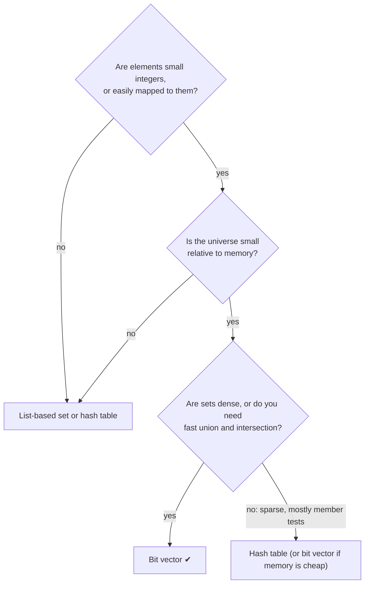

> [!goal] By the end of this note you can
> - Store sets over a universe of thousands using an array of words.
> - Count members fast with Kernighan's popcount trick.
> - Apply bit-vector thinking to real problems (the syllabus's "real-world situations").
> - Decide when a bit vector is the wrong tool.

## 1. When one word isn't enough

A single `unsigned int` holds 32 elements. For a universe of 1,000 you use an **array of words** and split each element into two coordinates:

```text
element x  →  word  = x / BITS      (which unsigned int)
              bit   = x % BITS      (which bit inside it)

BITS = 32:   x = 70  →  word 2, bit 6      (70 = 2·32 + 6)
```

It's the computer-word idea from [[Bit-Vector Sets]], repeated once per word. Because BITS is a power of two, `x / 32` is `x >> 5` and `x % 32` is `x & 31`, but the compiler already makes that optimisation for you with unsigned values, so write whichever reads clearer.

Number of words needed for N elements: `(N + BITS - 1) / BITS`, which is division rounded **up**.

## 2. A multi-word bitset in C

This is a different structure from the ADT Guide's single-word set: a fixed-size bitset for a large universe.

```c title="bitset.h" {8-10}
#include <limits.h>
#include <stdbool.h>
#include <stddef.h>

#define UNIVERSE 1000                                   /* elements 0 … 999 */
#define BITS     (sizeof(unsigned int) * CHAR_BIT)      /* bits per word    */
#define WORDS    ((UNIVERSE + BITS - 1) / BITS)         /* round up         */
#define WORD(x)  ((x) / BITS)
#define BIT(x)   ((x) % BITS)
#define MASK(x)  (1u << BIT(x))

typedef struct { unsigned int w[WORDS]; } BitSet;

static inline bool inRange(int x) { return x >= 0 && x < UNIVERSE; }

static inline void bsClear(BitSet *s) {
    for (size_t i = 0; i < WORDS; i++) s->w[i] = 0;
}
static inline void bsAdd(BitSet *s, int x) {
    if (inRange(x)) s->w[WORD(x)] |= MASK(x);
}
static inline void bsRemove(BitSet *s, int x) {
    if (inRange(x)) s->w[WORD(x)] &= ~MASK(x);
}
static inline bool bsHas(const BitSet *s, int x) {
    return inRange(x) && (s->w[WORD(x)] & MASK(x)) != 0;
}
/* Whole-set operations are one bitwise op per WORD, not per element. */
static inline void bsUnion(const BitSet *a, const BitSet *b, BitSet *out) {
    for (size_t i = 0; i < WORDS; i++) out->w[i] = a->w[i] | b->w[i];
}
```

Union over 1,000 elements is 32 word operations instead of 1,000 comparisons. That's the "O(N) but with a tiny constant" that makes bitsets fast in practice.

## 3. Counting members: popcount

How many elements are in a set? Count the 1 bits. The obvious loop checks all 32 bits per word. **Kernighan's trick** loops once per *set* bit:

```c
unsigned popcount(unsigned int x) {
    unsigned count = 0;
    while (x != 0) {
        x &= x - 1;     /* clears the lowest 1 bit */
        count++;
    }
    return count;
}
```

Why does `x & (x - 1)` clear the lowest 1? Subtracting 1 flips the lowest 1 to 0 and every 0 below it to 1. ANDing with the original wipes out exactly those bits:

```text
x         = 0101 1000
x - 1     = 0101 0111
x & (x-1) = 0101 0000     ← lowest 1 gone
```

A set's size is then the sum of `popcount(s->w[i])` over all words. GCC and Clang also provide `__builtin_popcount(x)`, which compiles to a single CPU instruction on modern machines.

## 4. Application: primes with a bitset sieve

The Sieve of Eratosthenes finds every prime below N by crossing out multiples. The "crossed out" marks are a set over {0 … N−1}, and bitsets make it 8× smaller than a `bool` array.

```c title="sieve.c"
#include <limits.h>
#include <stdio.h>
#include <string.h>

#define N     10000
#define BITS  (sizeof(unsigned int) * CHAR_BIT)
#define WORDS ((N + BITS - 1) / BITS)

static unsigned int composite[WORDS];   /* bit x = 1 means x is NOT prime */

static void mark(int x)      { composite[x / BITS] |= 1u << (x % BITS); }
static int  isMarked(int x)  { return (composite[x / BITS] >> (x % BITS)) & 1u; }

int main(void) {
    memset(composite, 0, sizeof composite);
    mark(0);
    mark(1);
    for (int p = 2; p * p < N; p++)
        if (!isMarked(p))
            for (int m = p * p; m < N; m += p)   /* smaller multiples already marked */
                mark(m);

    int count = 0;
    for (int x = 0; x < N; x++)
        if (!isMarked(x)) count++;

    printf("%d primes below %d, using %zu bytes of flags\n", count, N, sizeof composite);
    return 0;   /* 1229 primes below 10000, using 1252 bytes of flags */
}
```

A `bool` array would need 10,000 bytes. The bitset needs 1,252. The sieve runs in O(N log log N).

## 5. Other places bit vectors show up

| Where | The set | The operations |
|---|---|---|
| Unix file permissions | {read, write, execute} × {owner, group, others}: 9 bits. `chmod 754` = `111 101 100` | test a bit to allow or deny access |
| Weekly schedules | days a person is free, 7 bits | common free days = `a & b`; any-day coverage = `a \| b` |
| Seat maps, parking lots | occupied seats, one bit per seat | find a free seat = find a 0 bit |
| Graphics, games | which keys are pressed; chess **bitboards** (64 squares = one 64-bit word) | move generation with shifts and masks |
| Databases | *bitmap indexes*: one bitset per column value, one bit per row | `WHERE city='Cebu' AND active=1` → AND two bitmaps |
| Memory allocators, file systems | which blocks are free | allocate = find a 0 bit and set it |

### Bloom filters: bit vectors plus hashing

What if the universe is *huge*, like every possible URL? A **Bloom filter** hashes each item with k hash functions into a bit array of size m and sets those k bits. To query, check whether all k bits are 1.

- "No" answers are always correct: there are no false negatives.
- "Yes" answers can be wrong (a false positive), because other items may have set those same bits.

Browsers and databases use them as a cheap "definitely not here" check before an expensive lookup. You'll meet the hashing half in [[Hash Functions]].

## 6. When not to use a bit vector



A set of 5 student IDs from a universe of 10 million: bit vector = 1.25 MB, sorted array = 20 bytes. The universe size decides.

## 7. Practice

**Basic.** With 32-bit words, in which word and at which bit does element 100 live? And element 31? Element 32?

> [!answer]- Answer
> 100 → word 3, bit 4 (100 = 3·32 + 4). 31 → word 0, bit 31. 32 → word 1, bit 0.

**Intermediate.** A cinema has 200 seats, numbered 0–199. How many 32-bit words does a bitset of occupied seats need, and how many bytes? Compare with a `bool` array.

> [!answer]- Answer
> ⌈200 / 32⌉ = 7 words = 28 bytes (the last word uses only 8 of its 32 bits). A `bool` array needs 200 bytes, about 7× more.

**Intermediate.** Trace Kernighan's popcount on x = 0b10110000. How many loop iterations?

> [!answer]- Answer
> `10110000` → `10100000` → `10000000` → `00000000`: **3 iterations**, one per set bit.

**Advanced.** Write `bsIsEmpty(const BitSet *s)` and `bsEquals(a, b)` using whole words, never individual bits. What's their running time in terms of UNIVERSE?

> [!answer]- Answer (approach)
> Empty: every word is 0, so return false at the first non-zero word. Equal: compare word by word. Both are O(WORDS) = O(UNIVERSE / 32), which is still O(N) formally but 32× fewer steps than checking bits.

**Advanced (design).** Two students' free periods are stored as 10-bit schedules (bit k = period k is free). Write one expression that gives the periods when *exactly one* of them is free.

> [!answer]- Answer
> `a ^ b`, the symmetric difference.

## Next

Sets answer "is x in here?". Next is the ADT built around exactly that question: [[ADT Dictionary]].

## References

- [Sieve of Eratosthenes (cp-algorithms)](https://cp-algorithms.com/algebra/sieve-of-eratosthenes.html): bitset memory optimisation
- [Bloom filter (Wikipedia)](https://en.wikipedia.org/wiki/Bloom_filter)
- [Bit array (Wikipedia)](https://en.wikipedia.org/wiki/Bit_array): applications, popcount
- Kernighan & Ritchie, *The C Programming Language*, 2nd ed., exercise 2-9 (the `x &= x - 1` trick)
