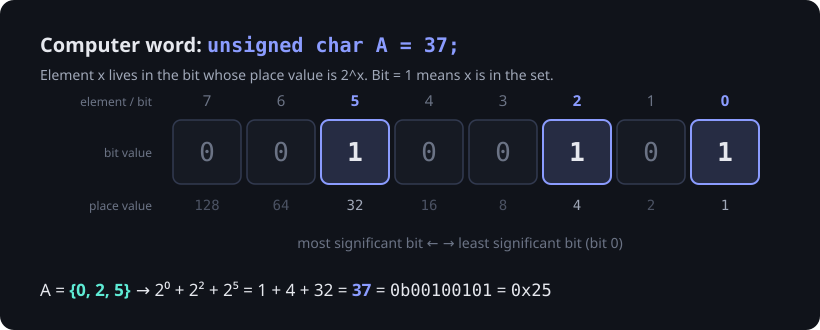

> [!goal] By the end of this note you can
> - Explain the course's two terms: **bit-vector** (element = array index) and **computer word** (element = bit position with place value 2ˣ).
> - Describe the three ADT Guide variations (bitmask, bit fields, boolean array) and compare their memory and running time.
> - Trace union, intersection and difference at the bit level.
> - Implement the Guide's functions yourself, with the hints and the self-check test at the end.

> [!warning] Graded work: you write these functions
> The Bit Vector Set functions in your ADT Guide are your practical activity. This note explains every idea they need, traces them on *different* numbers, and gives you a test file to check your own code. It won't write the functions for you.

## 1. The core idea

Pick a small universe, U = {0, 1, …, 7}. Instead of storing *which elements are present*, store a **yes/no for every possible element**:

```text
U:        0  1  2  3  4  5  6  7
A={0,2,5} 1  0  1  0  0  1  0  0     ← one yes/no per element of U
```

Now "is 5 in A?" is a single lookup. No searching.

Your handouts use two names for two ways of storing those yes/no values:

| Course term | Where element x lives | Example storage |
|---|---|---|
| **Bit-vector** | array **index** x holds 1 or 0 | `int A[8]` or `bool A[8]` |
| **Computer word** | the **bit** with place value 2ˣ inside one integer | `unsigned char A` |



In the computer word, the set *is* a number. {0, 2, 5} is 2⁰ + 2² + 2⁵ = **37**. Your ADT Guide's notation: `N` = decimal value, `( )` = binary, `{ }` = set elements, `[ ]` = array elements.

## 2. Set operations are bit operations

This is the payoff. With A = {0, 2, 5} = 37 and B = {2, 3, 7} = 140:

| Set operation | Bit operation | Bits | Value | Set |
|---|---|---|---|---|
| A | | `00100101` | 37 | {0, 2, 5} |
| B | | `10001100` | 140 | {2, 3, 7} |
| A ∪ B | `A \| B` | `10101101` | 173 | {0, 2, 3, 5, 7} |
| A ∩ B | `A & B` | `00000100` | 4 | {2} |
| A − B | `A & ~B` | `00100001` | 33 | {0, 5} |
| B − A | `B & ~A` | `10001000` | 136 | {3, 7} |
| A △ B | `A ^ B` | `10101001` | 169 | {0, 3, 5, 7} |

Check the columns by eye: a union bit is 1 if *either* input bit is 1; an intersection bit is 1 only if *both* are. Difference keeps A's 1s wherever B has a 0. That's the identity A − B = A ∩ complement(B) from [[ADT Set]].

Single-element operations use the mask `1u << x` from [[Bitwise Operations in C]]:

| Operation | Idea |
|---|---|
| insert x | turn bit x **on**: OR with the mask |
| delete x | turn bit x **off**: AND with the **inverted** mask |
| member x | AND with the mask and check for non-zero |

## 3. The three variations in your ADT Guide

### Variation 1: computer word / bitmask

The set is a single `unsigned char` (or `unsigned int`, `unsigned long`). Capacity is **8 × sizeof(type)** elements: 8 for a char, usually 32 for an int.

- `initialize`: the whole value becomes 0 (the empty set is literally zero).
- `insert` / `delete` modify the caller's variable, so they take `unsigned char *set`.
- `union` / `intersection` / `difference` take two values and **return** a new value, one operator each.
- `display` loops over positions 0–7 and prints the ones whose bit is on.

### Variation 2: bit fields

The set is a struct whose only member is a **bit field** of a fixed width:

```c
typedef struct {
    unsigned int field : 8;   /* exactly 8 usable bits */
} Set;
```

It's the same bit logic as Variation 1, but applied to `set->field` (through a pointer) or `A.field` (by value). What's worth knowing:

- `sizeof(Set)` is **4**, not 1, on gcc x86-64: the storage unit is the underlying `unsigned int`, and the `: 8` only limits how many bits you may use.
- Assigning a value that doesn't fit is **silently truncated**. `s.field = 300` stores 44 (300 mod 256). A missing safety check won't crash here; you just get quietly wrong data.
- You can't take the address of a bit field (`&s.field` is a compile error), which is why you pass the *struct's* address.
- How bit fields are packed in memory is implementation-defined. That doesn't matter for a single field, but don't `memcpy` bit fields between compilers.

### Variation 3: boolean array

The set is an array where index = element and value = membership:

```c
#define ARRAY_SIZE 8
typedef bool Set[ARRAY_SIZE];   /* needs <stdbool.h> */
```

This is the handout's **bit-vector** in its purest form. Two C facts explain the Guide's signatures:

1. **Arrays decay to pointers.** `void insert(Set set, int element)` already modifies the caller's array. No `*` needed, unlike Variations 1–2.
2. **C functions can't return arrays.** So union, intersection and difference can't be `Set union(Set A, Set B)`. The Guide passes a third array: `void union(Set A, Set B, Set C)`, and the function writes the answer into C.

Union, intersection and difference loop over every index, so they're **O(N)** (N = ARRAY_SIZE), not O(1).

Your 2026-09-28 lecture built this same variation with `int` slots and a `calloc`'d result. See [[Bit-Vector Union (Lecture)]] for the whiteboard, and for why that version needs small fixes to compile.

## 4. Comparing the variations

| | V1 computer word | V2 bit field | V3 boolean array |
|---|---|---|---|
| Memory for 8 elements | 1 byte | 4 bytes (unsigned int unit) | 8 bytes |
| Bits per element | 1 | 1 | 8 (a `bool` is a byte) |
| member / insert / delete | O(1) | O(1) | O(1) |
| union / intersection / difference | **O(1)**: one operator | **O(1)**: one operator | **O(N)**: loop |
| Max universe | 8·sizeof(type) (64 with `unsigned long long`) | field width ≤ bits of `unsigned int` | any N you declare |
| Returns a set by value? | yes | yes (struct) | no, needs an output parameter |
| Easy to read? | medium | medium | easiest |

That's the syllabus's "running time and memory space usage" comparison. **V1** is the most space-efficient; **V3** is the simplest and the only one that scales past a machine word, at 8× the memory and O(N) whole-set operations.

The handout's general verdict on bit vectors:

- ✅ member, insert and delete are O(1).
- ✅ Union, intersection and difference are O(N), or **a single logical operation** when the set fits in one computer word.
- ❌ Space is proportional to the **universe**, not to the set. Even an empty set costs N bits.
- **Use them when U is small and its elements are integers, or can be mapped to integers.**

## 5. Bugs to watch for

> [!bug] Deleting with XOR
> `*set ^= mask` **toggles**. If the element wasn't there, "delete" just inserted it. Delete needs AND with the inverted mask.

> [!bug] No safety check
> `insert(&A, 9)` on an 8-bit set means `1u << 9` = 512, which truncates to 0 in an `unsigned char`, so the insert silently does nothing. In the boolean array, `set[9] = true` writes **past the end of the array**. That's undefined behaviour and can corrupt a neighbouring variable. Check `0 <= element < capacity` first.

> [!bug] The handout's `boolean` enum is upside down
> The *Computer Word* handout declares `typedef enum {TRUE, FALSE} boolean;`. Enums count from 0, so **TRUE is 0 and FALSE is 1**. Then `if (isMember(A, 3))` runs its body when 3 is *not* a member. Either declare `{FALSE, TRUE}` or use `<stdbool.h>`'s `bool`.

> [!bug] `union` is a C keyword
> The ADT Guide's tables write `union(A, B)`, but `union` is reserved in C, so name it something like `setUnion`. (`delete` is fine in C. It's only reserved in C++.)

## 6. The question from the handout: what if 7 becomes 77?

The handout asks what happens to Set A = {3, 7, 0, 4, 9} if 7 is replaced by 77.

> [!hint]- Think first
> In a bit vector, element x needs slot x to exist. What's the smallest universe that contains 77? How many slots does A need now, and how many of them hold a 1?

> [!answer]- Answer
> The universe must grow to at least {0 … 77}: 78 slots (bits, or bools). A still has only 5 members, so 73 slots store 0. Memory follows the **largest possible element**, not the number of elements. That's the core weakness of bit vectors, and the reason for the handout's conclusion: use them only when U is small.

## 7. Practice

**Basic.** U = {0 … 7}. A = 90, B = 51.

1. Write A and B in binary and as sets.
2. Compute A ∪ B, A ∩ B, A − B as values and as sets.

> [!answer]- Answers
> 1. A = 90 = `01011010` = {1, 3, 4, 6}; B = 51 = `00110011` = {0, 1, 4, 5}.
> 2. A ∪ B = `01111011` = 123 = {0, 1, 3, 4, 5, 6}; A ∩ B = `00010010` = 18 = {1, 4}; A − B = `01001000` = 72 = {3, 6}.

**Intermediate.** Starting from `unsigned char S = 0;`, apply insert 7, insert 2, insert 7, delete 5, delete 2, insert 0. What's the final value of S?

> [!answer]- Answer
> insert 7 → 128; insert 2 → 132; insert 7 again → still 132 (OR is idempotent); delete 5 → still 132 (it wasn't there, and AND-NOT does nothing); delete 2 → 128; insert 0 → **129** = {0, 7}.

**Advanced.** Without looping over bits, write an expression that is non-zero exactly when A ⊆ B (every member of A is in B).

> [!answer]- Answer
> A ⊆ B means A − B is empty: `(A & ~B) == 0` (cast or mask to the set's width, because `~B` promotes to `int`). Equivalent: `(A | B) == B`, or `(A & B) == A`.

## 8. Implement the Guide yourself

Work through the Guide one variation at a time: initialize → insert → display (so you can see results) → find → delete → union / intersection / difference.

> [!hint]- Hint: building the mask safely
> Use an unsigned 1 (`1u`) and range-check the element *before* shifting. What's the valid range when the set is an `unsigned char`? How do you compute it with `sizeof` instead of hard-coding 8?

> [!hint]- Hint: Variation 2 through a pointer
> With `Set *set`, the field is `set->field`. With `Set A` by value, it's `A.field`. The union function builds a `Set C`, sets `C.field`, and returns C.

> [!hint]- Hint: Variation 3's union
> One loop from 0 to ARRAY_SIZE − 1. Each `C[i]` is a boolean expression of `A[i]` and `B[i]`. Which logical operator matches each set operation?

> [!hint]- Hint: display with commas
> Print `{`, then print each member, with a comma *before* every member except the first (track a "first" flag). Then print `}`. This avoids a trailing comma.

### Self-check test (Variation 1)

Put this in its own file next to your implementation. It uses the ADT Guide's own example values. Rename `setUnion` and the other functions to match your names.

```c title="test_bitvector_v1.c"
#include <assert.h>
#include <stdbool.h>
#include <stdio.h>

/* Your implementation's prototypes (Variation 1: computer word). */
void initialize(unsigned char *set);
void insert(unsigned char *set, int element);
void delete(unsigned char *set, int element);
bool find(unsigned char set, int element);
unsigned char setUnion(unsigned char A, unsigned char B);
unsigned char setIntersection(unsigned char A, unsigned char B);
unsigned char setDifference(unsigned char A, unsigned char B);

int main(void) {
    unsigned char A;
    initialize(&A);
    assert(A == 0);

    insert(&A, 1);  assert(A == 2);     /* {1}    (00000010) */
    insert(&A, 6);  assert(A == 66);    /* {1, 6} (01000010) */
    insert(&A, 6);  assert(A == 66);    /* no duplicates     */
    insert(&A, 99); assert(A == 66);    /* out of range: ignored, no crash */

    assert(find(A, 6) && find(A, 1) && !find(A, 3));

    delete(&A, 6);  assert(A == 2);
    delete(&A, 6);  assert(A == 2);     /* deleting a non-member changes nothing */
    delete(&A, 1);  assert(A == 0);

    unsigned char X = 66, Y = 200;      /* {1, 6} and {3, 6, 7} */
    assert(setUnion(X, Y)        == 202);   /* {1, 3, 6, 7} */
    assert(setIntersection(X, Y) == 64);    /* {6}          */
    assert(setDifference(X, Y)   == 2);     /* {1}          */

    puts("All Variation 1 checks passed.");
    return 0;
}
```

Compile both files together: `gcc -std=c11 -Wall -Wextra your_set.c test_bitvector_v1.c -o test && ./test`. A failing `assert` prints the line number, and the comment on that line tells you the expected set.

## Next

One word holds 8, 32 or 64 elements. For bigger universes, and for where bit vectors show up in real software: [[Bit Vectors in the Real World]].

## References

- Course ADT Guide: *Bit Vector Set*, Variations 1–3
- Course handouts: *ADT Set and Bit-Vector*, *Computer Word*
- [Bit-fields (cppreference, C)](https://en.cppreference.com/w/c/language/bit_field): width rules; layout is implementation-defined
- [SEI CERT C INT34-C](https://wiki.sei.cmu.edu/confluence/display/c/INT34-C.+Do+not+shift+an+expression+by+a+negative+number+of+bits+or+by+greater+than+or+equal+to+the+number+of+bits+that+exist+in+the+operand): why the safety check matters
- Aho, Hopcroft & Ullman, *Data Structures and Algorithms*, §4.3 (bit-vector implementation of sets)
