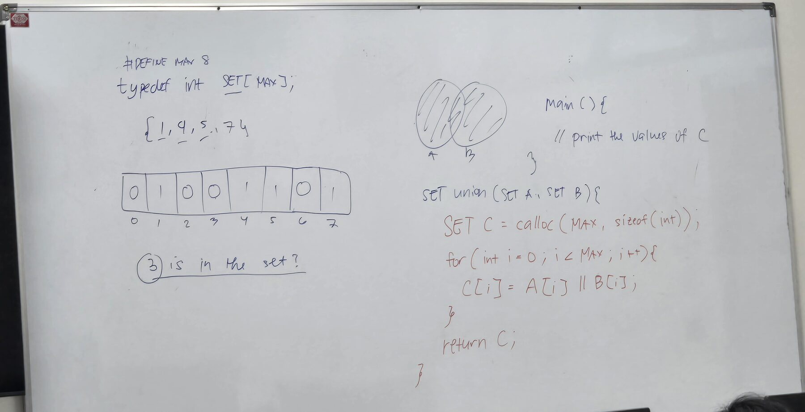

> [!goal] From this lecture you should be able to
> - Store a set as an `int` array where index = element and value = 1 or 0.
> - Answer a membership question with a single array lookup.
> - Write union element by element with `||`, and explain why the board's version needs small fixes to compile.



## 1. What was on the board

Transcribed as written:

```c title="whiteboard (as written)"
#DEFINE MAX 8
typedef int SET[MAX];

/* {1, 4, 5, 7} */
/* index:  0  1  2  3  4  5  6  7 */
/* value:  0  1  0  0  1  1  0  1 */

/* (3) is in the set? */

SET union(SET A, SET B) {
    SET C = calloc(MAX, sizeof(int));
    for (int i = 0; i < MAX; i++) {
        C[i] = A[i] || B[i];
    }
    return C;
}

main() {
    // print the values of C
}
```

Plus a Venn diagram of A and B with **both circles shaded**: that's A ∪ B.

## 2. The representation

`typedef int SET[MAX];` makes `SET` a name for "array of 8 ints". It's Variation 3 from your ADT Guide, the **bit-vector** in the handout's sense: **index = element, value = membership**.

The set {1, 4, 5, 7}:

| Index (element) | 0 | 1 | 2 | 3 | 4 | 5 | 6 | 7 |
|---|---|---|---|---|---|---|---|---|
| Value | 0 | **1** | 0 | 0 | **1** | **1** | 0 | **1** |

The elements present are exactly the indices holding 1. Order and duplicates don't exist here: each element has one slot, and a slot is either 1 or 0.

> [!question] "3 is in the set?"
> How do you answer this without searching?

> [!answer]- Answer
> Look at index 3: `A[3]` is **0**, so no, 3 is not in the set. One array access, **O(1)**, whatever the size of the set. That's the whole point of a bit vector: `member(x, A)` is just `A[x] == 1` (after checking `0 <= x < MAX`).

## 3. Union, one slot at a time

A ∪ B holds everything in A **or** B, so slot i of C is 1 when slot i of A **or** slot i of B is 1:

| A[i] | B[i] | `A[i] \|\| B[i]` |
|---|---|---|
| 0 | 0 | 0 |
| 0 | 1 | 1 |
| 1 | 0 | 1 |
| 1 | 1 | 1 |

Worked example with A = {1, 4, 5, 7} and B = {0, 4, 6}:

| i | 0 | 1 | 2 | 3 | 4 | 5 | 6 | 7 |
|---|---|---|---|---|---|---|---|---|
| A | 0 | 1 | 0 | 0 | 1 | 1 | 0 | 1 |
| B | 1 | 0 | 0 | 0 | 1 | 0 | 1 | 0 |
| **C = A \|\| B** | **1** | **1** | 0 | 0 | **1** | **1** | **1** | **1** |

C = {0, 1, 4, 5, 6, 7}. The loop always runs MAX times, whatever the sets contain, so union is **O(MAX)**, the size of the universe. (A computer-word set does the same thing in one `|`. See [[Bit-Vector Sets]].)

> [!tip] `||` or `|`?
> For arrays of 0s and 1s, both give the same answer. `||` always produces 0 or 1. `|` is bitwise, so `2 | 1` is 3. If a slot ever held something other than 0 or 1 (say, a count), `||` would still give a clean 1. The board's choice is the safer one.

## 4. Making the board code compile

Board code is shorthand. Three things stop gcc, all worth knowing for exams and labs.

**① `#DEFINE` → `#define`.** Preprocessor directives are case-sensitive.
gcc: `error: invalid preprocessing directive #DEFINE`

**② `union` is a C keyword.** It's the `union { … }` type, so it can't be a function name.
gcc: `error: expected '{' before '(' token`. Rename it, e.g. `setUnion`. (Your ADT Guide writes `union` too; see [[Bit-Vector Sets]].)

**③ A function can't return an array, and an array can't be initialised from `calloc`.** `SET` is an array type, so after renaming:
gcc: `error: 'setUnion' declared as function returning an array` and `error: invalid initializer`.

`calloc` returns a **pointer** to heap memory. So hold it in a pointer, and return a pointer:

```c
int *setUnion(SET A, SET B) {              /* return type: pointer, not SET */
    int *C = calloc(MAX, sizeof(int));     /* C is a pointer to MAX ints    */
    /* … the loop from the board, unchanged: C[i] still works … */
}
```

`C[i]` works exactly the same on a pointer as on an array, so the loop doesn't change. Because the memory comes from `calloc`:

- `#include <stdlib.h>` is needed for `calloc` and `free`.
- `calloc` can return `NULL`, so check before using `C`.
- The **caller must `free` C** when done, or it leaks 32 bytes every call.

The other common fix skips the heap entirely. The caller passes C in, which is exactly your ADT Guide's Variation 3 signature: `void union(Set A, Set B, Set C);`. Arrays decay to pointers, so writing to `C[i]` inside the function fills the caller's array, and nothing needs freeing. Know both. Which one your instructor wants in the lab decides which one you write.

## 5. Memory: `int` vs the other variations

`typedef int SET[8]` costs **32 bytes** (`sizeof(SET)` on gcc x86-64, since each int is 4 bytes) to store 8 yes/no values:

| Representation | Bytes for U = {0 … 7} |
|---|---|
| `int SET[8]` (this lecture) | 32 |
| `bool Set[8]` (ADT Guide, Variation 3) | 8 |
| bit field `unsigned int field : 8` (Variation 2) | 4 |
| `unsigned char` computer word (Variation 1) | 1 |

Same logic, 32× the memory of the computer word. That's the trade-off the syllabus asks you to "differentiate … in terms of running time and memory space usage".

## 6. The board exercise: print the values of C

`main() { // print the values of C }` is yours to write. Some nudges:

> [!hint]- Hint 1: making A and B
> A `SET` can be initialised like any array: list the 8 slot values in braces, in index order. Build A = {1, 4, 5, 7} from the table in section 2, then pick your own B.

> [!hint]- Hint 2: "the values of C"
> Decide what to print. The raw slots (`1 1 0 0 1 1 1 1`) show the bit vector; the **elements** (`{0, 1, 4, 5, 6, 7}`) show the set. The second only prints index i when `C[i]` is 1. Doing both is a good self-check.

> [!hint]- Hint 3: don't forget
> If your union returns calloc'd memory: check it isn't `NULL`, and `free` it after printing. Also, `main()` should be `int main(void)` and return 0.

## 7. Practice

**Basic.** Using the board's A = {1, 4, 5, 7}: what are `A[0]`, `A[5]` and `A[7]`? Is 6 in the set?

> [!answer]- Answer
> `A[0]` = 0, `A[5]` = 1, `A[7]` = 1. `A[6]` = 0, so **6 is not** in the set.

**Intermediate.** Change **one expression** in the loop to get intersection instead. And to get difference A − B?

> [!answer]- Answer
> Intersection: `C[i] = A[i] && B[i];`. Difference: `C[i] = A[i] && !B[i];` (in A and **not** in B). Everything else stays the same.

**Intermediate.** With A = {1, 4, 5, 7} and B = {0, 4, 6}, what are A ∩ B and A − B as arrays?

> [!answer]- Answer
> A ∩ B = `0 0 0 0 1 0 0 0` = {4}. A − B = `0 1 0 0 0 1 0 1` = {1, 5, 7}.

**Advanced.** A classmate writes `SET setUnion(SET A, SET B)` and `SET C;` inside, returns C, and says the fix is just "use a local array instead of calloc". Why does that still fail, and what would go wrong even if C allowed it?

> [!answer]- Answer
> It still fails because the return type is still an array, and C forbids returning arrays at all. Even if it compiled (say, returning `int *` pointing at a local `int C[MAX]`), the local array lives on the **stack** and is destroyed when the function returns, so the caller would hold a dangling pointer. That's why the board uses `calloc` (heap memory outlives the call), or why Variation 3 passes C in from the caller.

## Next

Back on the path: sets bigger than one word, and where bit vectors show up in real software. [[Bit Vectors in the Real World]].

## References

- Class whiteboard, CIS-2101, 2026-09-28 (photo above)
- Course ADT Guide: *Bit Vector Set*, Variation 3 (boolean/enum array)
- [Arrays: "Functions cannot return arrays" (cppreference, C)](https://en.cppreference.com/w/c/language/array)
- [`calloc` (cppreference, C)](https://en.cppreference.com/w/c/memory/calloc)
