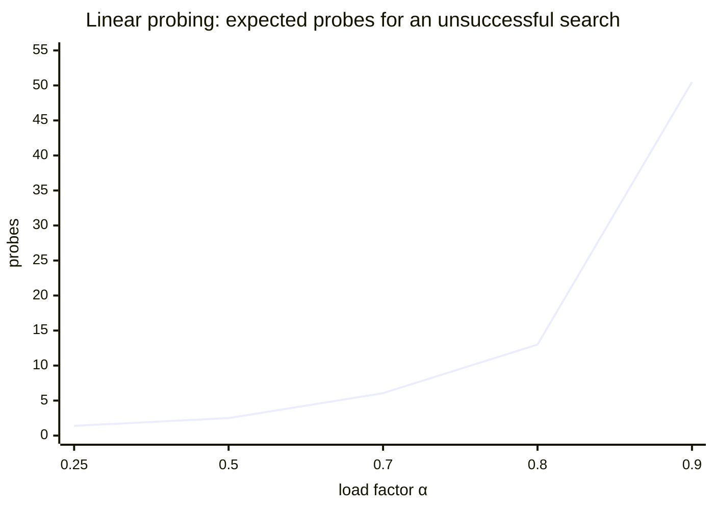

> [!goal] By the end of this note you can
> - Estimate the expected number of probes from the load factor α, for both kinds of hashing.
> - Justify the handout's **80% packing density** rule with numbers.
> - Explain rehashing and why growing a table is still O(1) amortized.
> - Pick and size a hash table for a real application.

## 1. Load factor, again

α = n / m, where n is the number of stored elements and m is the number of buckets (open hashing) or slots (closed hashing).

- **Open hashing:** α is the average chain length. It can be greater than 1.
- **Closed hashing:** α is the fraction of the array in use, so 0 ≤ α < 1. Your handout calls it **packing density**.

Everything below assumes a hash function that spreads keys **uniformly**. A bad hash function beats any formula.

## 2. Expected cost as the table fills up

Standard results: separate chaining from basic probability, linear probing from Knuth's analysis.

| Structure | Successful search (x is present) | Unsuccessful search / insert |
|---|---|---|
| Open hashing (chaining) | ≈ 1 + α/2 nodes | ≈ α nodes |
| Closed hashing, linear probing | ≈ ½ (1 + 1/(1−α)) probes | ≈ ½ (1 + 1/(1−α)²) probes |

Plugging in numbers (computed):

| α | Chaining, hit | Chaining, miss | Linear probing, hit | Linear probing, miss |
|---|---|---|---|---|
| 0.25 | 1.13 | 0.25 | 1.17 | 1.39 |
| 0.50 | 1.25 | 0.50 | 1.50 | 2.50 |
| 0.70 | 1.35 | 0.70 | 2.17 | 6.06 |
| **0.80** | 1.40 | 0.80 | **3.00** | **13.0** |
| 0.90 | 1.45 | 0.90 | 5.50 | 50.5 |
| 0.95 | 1.48 | 0.95 | 10.5 | 200.5 |

Read the last column. A failed lookup in a linear-probing table goes from 6 probes at 70% full, to 13 at 80%, to **50 at 90%**. The cost blows up as α → 1, because clusters merge into huge runs. **That's the reason behind the 80% rule of thumb**: past it, closed hashing gets expensive fast. Chaining barely notices.



## 3. When the table gets too full: rehashing

When α crosses a threshold (e.g. 0.75 for closed hashing, 1–2 for chaining), **grow the table**:

```text
rehash(D):
    newSize = next prime ≥ 2 × oldSize
    allocate an empty table of newSize
    for every element x in the old table (skip EMPTY and DELETED):
        insert x into the new table using H(x) % newSize    -- positions change!
    free the old table
```

You **can't** copy slots across unchanged: `H(x) % 10` and `H(x) % 23` are different numbers. Every element gets re-hashed, which is where the name comes from.

A single rehash costs O(n). But if the size doubles each time, a rehash happens only after n more inserts, so the cost spreads out to **O(1) amortized per insert**. It's the same argument as a dynamic array that doubles with `realloc`.

Rehashing also clears out DELETED tombstones in closed hashing: they simply don't get copied.

## 4. Choosing between open and closed hashing

| Concern | Open hashing | Closed hashing |
|---|---|---|
| Capacity | grows naturally | fixed; rehash when full |
| Performance near full | degrades gently | collapses as α → 1 |
| Memory per element | element + a pointer, plus `malloc` overhead | element only, but empty slots are wasted |
| Deletion | unlink and free | needs DELETED markers |
| Cache behaviour | chases pointers around memory | scans neighbouring slots: fast in practice |
| Good default for | unknown or growing n | known n, small elements, speed-critical |

Real systems use both. Java's `HashMap` chains, and switches long chains to balanced trees. Python's `dict` and Rust's `HashMap` use open addressing.

## 5. Where hash tables run things

| Application | Key → value | Why hashing |
|---|---|---|
| **Database hash index** | column value → row locations | `WHERE id = 42` in O(1) instead of scanning the table: the syllabus's "organizing and manipulating a database" |
| Database hash join | join key → matching rows | join two tables in O(n + m) instead of O(n·m) |
| Compiler symbol table | identifier → type and address | every variable use is a lookup |
| Caches and memoization | request → stored result | skip recomputation on a repeat |
| Deduplication | item → seen? | O(1) "have I seen this?" |
| Counting | item → count | word frequencies (see [[Open Hashing]]) |
| Sets in languages | element → present | Python `set`, C++ `unordered_set` |

> [!warning] Not the same "hash" as password hashing
> Password storage uses **cryptographic** hashes (bcrypt, Argon2). They're deliberately *slow* and designed so you can't reverse them or find collisions. A hash-table function is fast and doesn't care about attackers. Never use `x % B`, or djb2, for security.

## 6. Worked design problem

> [!example] Index 5,000 student records by ID
> **Closed hashing** with a target α ≤ 0.75 needs m ≥ 5000 / 0.75 ≈ 6,667 slots. The next prime is **6,673**, so α = 5000 / 6673 ≈ 0.75. Expected: about 2.5 probes to find a student, about 8.5 for a missing ID.
>
> **Open hashing** with α ≈ 1 needs B ≈ 5,000 buckets. The next prime is **5,003**. Expected: about 1.5 nodes for a hit, 1 for a miss, but you pay one pointer and one `malloc` per record.
>
> If records are added all semester, chaining avoids rehashing. If the roster is fixed at enrolment, closed hashing is simpler and faster.

## 7. Practice

**Basic.** A closed-hashing table has 200 slots and 150 elements. What's α? Using the table in section 2, roughly how many probes does a failed search take?

> [!answer]- Answer
> α = 150 / 200 = 0.75. Linear probing miss ≈ ½(1 + 1/0.25²) = ½(1 + 16) = **8.5 probes**.

**Intermediate.** You rehash a closed table from size 11 to size 23. Element 30 was at slot 8 (`30 % 11 = 8`). Where does it go now, if the slot is free?

> [!answer]- Answer
> 30 % 23 = **7**. Positions change, which is why every element has to be re-inserted rather than copied.

**Intermediate.** Why does chaining's *unsuccessful* search cost (≈ α) come out *lower* than its successful one (≈ 1 + α/2)?

> [!answer]- Answer
> A miss walks the whole chain, which averages α nodes, but some chains are empty and cost zero comparisons. A hit always makes at least one comparison (the matching node) plus, on average, half of the *other* elements in its chain: 1 + α/2. For α < 2 the miss comes out cheaper.

**Advanced.** A closed table uses linear probing, and after many inserts and deletes it's 40% occupied and **45% DELETED**. Searches are slow. Explain why, and what fixes it.

> [!answer]- Answer
> DELETED slots don't stop a search, so for probing purposes the table behaves as if it's 85% full: α_effective = 0.85, about 23 probes per miss. Rehashing into a fresh table (same or bigger size) discards the tombstones and brings α back to 0.40.

**Advanced (research).** Your handout asks about *average search length*. How would you compute a table's **measured** ASL, and how does it compare with ½(1 + 1/(1−α))?

> [!hint]- Hint
> Measured ASL = sum over stored elements of (probes to find it) ÷ n. See the worked trace in [[Closed Hashing]] (ASL = 12/7 ≈ 1.71 at α = 0.7). The formula predicts 2.17. For such a small table, randomness dominates. The formula is an *expectation* over random keys and large tables.

## Next

Dictionaries answer "is it here?". The last ADT answers "what's most urgent?": [[ADT Priority Queue]].

## References

- [Linear probing lecture notes (Stanford CS166)](https://web.stanford.edu/class/archive/cs/cs166/cs166.1166/lectures/12/Small12.pdf): Knuth's ½(1 + 1/(1−α)) and ½(1 + 1/(1−α)²)
- [Analysis of separate chaining (UCSD CSE 100)](https://cseweb.ucsd.edu/~kube/cls/100/Lectures/lec16/lec16-31.html)
- [Hash table (Wikipedia)](https://en.wikipedia.org/wiki/Hash_table): load factor, dynamic resizing
- [Hashing and Hash Tables (An Open Guide to Data Structures and Algorithms)](https://pressbooks.palni.org/anopenguidetodatastructuresandalgorithms/chapter/hashing-and-hash-tables/)
- Course handout: *Topics: Closed Hashing* (packing density, 80% rule of thumb)
