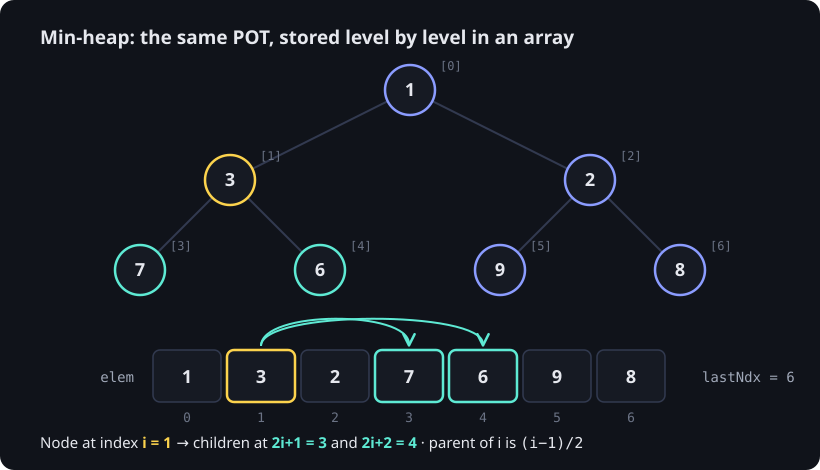

> [!goal] By the end of this note you can
> - Build a heap from an unsorted array both ways the handout shows, and explain why **heapify** is O(n).
> - Trace in-place heap sort, and predict whether a min-heap gives ascending or descending order.
> - State heap sort's time, space and stability, and compare it with other sorts.
> - Use heaps for top-k, k-way merge and running medians.

> [!warning] Graded work
> Heap sort on your `HeapList` is a practical and exam topic (your final exam includes a heap problem). This note gives traces, pseudocode and a randomized tester. The C function is yours to write.

## 1. The plan

From your *Heap Sort* handout:

```text
Unsorted List  →  Heap  →  Sorted List
```

Both phases happen **inside the same array**. No second array is needed.

## 2. Phase 1: making the unsorted list a heap

The handout gives **two ways**.

### Way 1: insert each element into an initially empty POT

Pretend the heap is empty (`lastNdx = −1`, saving the real end in `oldLast`) and "insert" the elements one by one. They're already sitting in the array, so each insert just grows the heap by one slot and bubbles up.

Trace on `7 3 9 1 6 2 8`:

| Insert | Heap part of the array after bubble-up | Swaps |
|---|---|---|
| 7 | `7` | 0 |
| 3 | `3 7` | 1 |
| 9 | `3 7 9` | 0 |
| 1 | `1 3 9 7` | 2 |
| 6 | `1 3 9 7 6` | 0 |
| 2 | `1 3 2 7 6 9` | 1 |
| 8 | `1 3 2 7 6 9 8` | 0 |

Each insert costs O(log n), so this is **O(n log n)** overall.

### Way 2: heapify, bottom-up

Leaves are already tiny heaps. So start at the **last internal node**, `(lastNdx − 1) / 2`, and walk **backwards to the root**, pushing each node down into the heap below it (the same push-down loop as deletemin).

Same array, `7 3 9 1 6 2 8` (lastNdx = 6, so start at i = 2):

| i | Node | Push down | Array after |
|---|---|---|---|
| 2 | 9 | children 2, 8 → swap with 2 | `7 3 2 1 6 9 8` |
| 1 | 3 | children 1, 6 → swap with 1; then a leaf | `7 1 2 3 6 9 8` |
| 0 | 7 | children 1, 2 → swap with 1; then children 3, 6 → swap with 3 | `1 3 2 7 6 9 8` |



Here both methods give the same heap. In general they don't: your handout's example `5 1 8 2 9 1 7 2 3` produces two **different** valid heaps.

### Why heapify is O(n), not O(n log n)

Push-down cost depends on a node's **height**, not its depth:

- About n/2 nodes are leaves: 0 work.
- About n/4 sit one level up: at most 1 swap each.
- About n/8 sit two levels up: at most 2 swaps each, and so on.

Total ≤ n·(1/4 + 2/8 + 3/16 + …) = n · Σ h/2^(h+1) ≤ **n**. Most nodes are near the bottom, where pushing down is nearly free. Way 1 is the opposite: most inserts happen when the heap is already big, near the bottom, and may climb all the way to the root.

## 3. Phase 2: heap → sorted list

Your handout: *perform deletemin until the heap is empty*. The trick that keeps it in place: each deletemin frees the **last** slot of the heap, and that's exactly where the removed minimum gets stored.

```text
while lastNdx > 0:
    swap elem[0] (the min) with elem[lastNdx]      -- min goes to the freed slot
    lastNdx = lastNdx − 1                          -- the heap shrinks by one
    push elem[0] down within elem[0 … lastNdx]
lastNdx = oldLast                                  -- the whole array is the sorted list
```

Trace, starting from the heap `1 3 2 7 6 9 8` (heap | sorted):

| Removed | Push down | Array (heap │ sorted part) |
|---|---|---|
| 1 | 8 → swap with 2 | `2 3 8 7 6 9 │ 1` |
| 2 | 9 → swap 3, then swap 6 | `3 6 8 7 9 │ 2 1` |
| 3 | 9 → swap 6, then swap 7 | `6 7 8 9 │ 3 2 1` |
| 6 | 9 → swap 7 | `7 9 8 │ 6 3 2 1` |
| 7 | 8 (child 9 is larger: stop) | `8 9 │ 7 6 3 2 1` |
| 8 | — | `9 │ 8 7 6 3 2 1` |

Final: `9 8 7 6 3 2 1`. **Descending.**

> [!important] Min-heap → descending, max-heap → ascending
> Each minimum lands at the *end* of the shrinking heap, so the smallest value ends up last. That's why your handout's table says a MinHeap sorts in place in **descending** order and a MaxHeap in **ascending** order. For ascending order with a min-heap you'd need a second array, and then it's no longer in place.

## 4. Properties

| | Heap sort |
|---|---|
| Time: best, average, worst | **O(n log n)**: O(n) heapify + n pushes of O(log n) |
| Extra space | **O(1)**: in place |
| Stable? | **No**: equal keys can swap order |

**Why it's unstable, on a tiny example.** Sort `2a 2b 1` descending with a min-heap (a and b tag the two 2s). Heapify gives `1 2b 2a`. Extract 1 → `2a 2b │ 1`. Extract → `2b │ 2a 1`. Result: `2b 2a 1`. The two 2s came out in the opposite order from the input.

Compared with the sorts you know:

| Sort | Worst time | Extra space | Stable |
|---|---|---|---|
| Bubble / insertion / selection | O(n²) | O(1) | bubble, insertion: yes; selection: no |
| Merge sort | O(n log n) | O(n) | yes |
| Quicksort | O(n²) (average n log n) | O(log n) | no |
| **Heap sort** | **O(n log n)** | **O(1)** | no |

Heap sort is the only one here with a guaranteed O(n log n) *and* O(1) extra space. The price is instability, and in practice it's usually a bit slower than quicksort because it jumps around memory.

## 5. Heaps beyond sorting

| Problem | How a heap solves it | Cost |
|---|---|---|
| **Top-k largest** of a huge stream | keep a **min**-heap of size k; if a new item beats the root, replace the root and push down | O(n log k), with k items in memory |
| **Merge k sorted lists** | min-heap holding the current head of each list; deletemin, then insert that list's next item | O(n log k) |
| **Running median** | a max-heap for the lower half and a min-heap for the upper half, balanced by size | O(log n) per new number |
| **Dijkstra's / Prim's** (final term) | min-heap of vertices keyed by tentative distance or edge weight | O((V + E) log V) |
| **Huffman coding** | repeatedly deletemin twice, merge, insert | O(n log n) |

The top-k idea, in pseudocode:

```text
topK(stream, k):
    H = empty min-heap
    for each x in stream:
        if size(H) < k:        insert(x, H)
        else if x > min(H):    replace the root with x; push it down
    return the contents of H          -- the k largest, in heap order
```

Why a **min**-heap for the *largest* items? Its root is the weakest of the current top k, the one to evict first.

## 6. Testing your heap sort

A randomized tester that compares your `heapSort` against the C library's `qsort`, over 1,000 arrays including sizes 0 and 1 and lots of duplicates:

```c title="test_heapsort.c"
#include <assert.h>
#include <stdio.h>
#include <stdlib.h>
#include <string.h>

#define SIZE 64
typedef struct {
    int elem[SIZE];
    int lastNdx;
} HeapList;

/* ---- Yours: sorts HL.elem[0..lastNdx] in place, DESCENDING (min-heap). ---- */
void heapSort(HeapList *HL);

/* qsort comparator for descending order (the reference answer). */
static int cmpDesc(const void *a, const void *b) {
    int x = *(const int *)a, y = *(const int *)b;
    return (x < y) - (x > y);
}

int main(void) {
    srand(2101);
    for (int trial = 0; trial < 1000; trial++) {
        HeapList HL;
        int n = rand() % SIZE;                 /* includes n = 0 and n = 1 */
        HL.lastNdx = n - 1;
        int expected[SIZE];
        for (int i = 0; i < n; i++)
            HL.elem[i] = expected[i] = rand() % 20;   /* small range: lots of duplicates */

        qsort(expected, n, sizeof(int), cmpDesc);
        heapSort(&HL);

        if (memcmp(HL.elem, expected, n * sizeof(int)) != 0) {
            printf("Mismatch on trial %d (n = %d)\n  got:     ", trial, n);
            for (int i = 0; i < n; i++) printf("%d ", HL.elem[i]);
            printf("\n  expected: ");
            for (int i = 0; i < n; i++) printf("%d ", expected[i]);
            putchar('\n');
            return 1;
        }
    }
    puts("1000 random arrays sorted correctly.");
    return 0;
}
```

`cmpDesc` returns `(x < y) - (x > y)` rather than `y - x`, which can overflow for large ints. Match your function's name and struct to the tester's, or the other way round. If you sort ascending with a max-heap, flip `cmpDesc`.

## 7. Practice

**Basic.** Heapify `9 8 7 6 5 4 3` (lastNdx = 6) into a min-heap. Give the array after each i.

> [!answer]- Answer
> i = 2: 7 with children 4, 3 → swap with 3 → `9 8 3 6 5 4 7`.
> i = 1: 8 with children 6, 5 → swap with 5 → `9 5 3 6 8 4 7`.
> i = 0: 9 with children 5, 3 → swap with 3 → `3 5 9 6 8 4 7`; 9 now has children 4, 7 → swap with 4 → `3 5 4 6 8 9 7`.

**Intermediate.** Continue: run phase 2 on `3 5 4 6 8 9 7` for **two** extractions. Show heap │ sorted.

> [!answer]- Answer
> Extract 3: swap with 7 → `7 5 4 6 8 9 │ 3`; push 7: children 5, 4 → swap with 4 → `4 5 7 6 8 9 │ 3`; 7's only child is 9 → stop.
> Extract 4: swap with 9 → `9 5 7 6 8 │ 4 3`; push 9: children 5, 7 → swap with 5 → `5 9 7 6 8`; children 6, 8 → swap with 6 → `5 6 7 9 8 │ 4 3`.

**Intermediate.** Why does heapify start at `(lastNdx − 1) / 2` and not at `lastNdx`?

> [!answer]- Answer
> Every index after `(lastNdx − 1) / 2` is a leaf: its left child `2i + 1` would be past `lastNdx`. A single leaf already satisfies the POT property, so pushing it down does nothing. Starting at the last internal node skips about half the array for free.

**Advanced.** Your array has 1,000,000 numbers and you need only the 10 smallest, in order. Which is better: heap sort everything, or something else?

> [!answer]- Answer
> Build a min-heap with heapify, O(n), then deletemin 10 times, O(10 log n). That's about 1,000,000 + 200 steps, versus about 20,000,000 for a full sort. Or stream it with a size-10 **max**-heap: O(n log 10), with only 10 items in memory.

**Advanced (your practical): hints.**

> [!hint]- Hint: reuse, don't rewrite
> Heapify and phase 2 both need the *same* push-down routine. Write it once as `pushDown(elem, i, last)` that works on `elem[0 … last]`, then call it from both. Note that phase 2 passes a shrinking `last`.

> [!hint]- Hint: don't lose the length
> Phase 2 decrements `lastNdx` down to 0. Save the original (`oldLast`, as the handout does) and restore it at the end, so the caller still sees the full sorted list.

> [!hint]- Hint: edge cases
> Empty (`lastNdx == −1`), a single element, all elements equal, and already sorted input in either direction. The tester covers them. Make sure your loops don't run with a negative `last`.

## Where to go next

That's the whole weeks 7–12 path, from [[What Is an ADT]] to here. Good review loops:

- Redo the traces in [[Closed Hashing]] and [[Partially Ordered Trees]] on paper without looking.
- Implement one ADT Guide variation from [[Bit-Vector Sets]] and pass the self-check test.
- Explain to someone (or a rubber duck) why heapify is O(n).

## References

- Course handout: *Heap Sort* (HeapList, two ways to build a heap, MinHeap vs MaxHeap, in-place sorting direction)
- [Binary heap: build heap proof (Growing with the Web)](https://www.growingwiththeweb.com/data-structures/binary-heap/build-heap-proof/)
- [Heap sort (Edinburgh IADS lecture 12)](https://opencourse.inf.ed.ac.uk/sites/default/files/https/opencourse.inf.ed.ac.uk/inf2-iads/2024/iads12heapsort0.pdf)
- [Heapsort (Wikipedia)](https://en.wikipedia.org/wiki/Heapsort): in-place, unstable, complexity
- Aho, Hopcroft & Ullman, *Data Structures and Algorithms*, §8.4 (heapsort)
