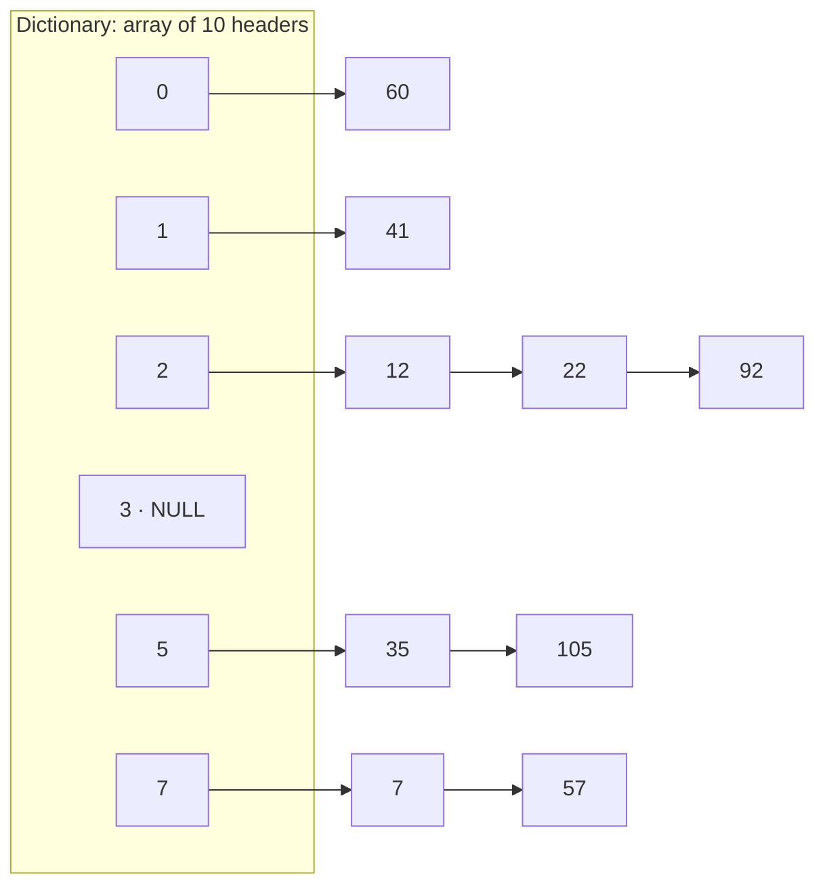

> [!goal] By the end of this note you can
> - Draw an open-hashing dictionary and trace inserts and deletes by hand.
> - Write insert, member and delete as pseudocode, including the duplicate check.
> - State the average and worst-case running times, and what the load factor α means here.
> - Use the `Node **` technique to insert into and delete from a chain without special cases.

> [!warning] Graded work: you write the integer dictionary
> Your *Open Hashing* handout's Practice Exercises 1–3 (the hash function, the Dictionary type, `initDic`, `displayDic`, `insert`, `populateDic`, `delete`, `isMember`) are yours to write. This note teaches the structure with traces and pseudocode, and shows full C for a **different** problem: counting words.

## 1. The structure

Open hashing, also called **external hashing** or **separate chaining**, is an array of B **bucket headers**. Each header is the start of a linked list: every element whose hash is b goes into list b.

Using `H(x) = x % 10` on {7, 12, 22, 35, 41, 57, 60, 92, 105}:



(Buckets 4, 6, 8 and 9 are empty, just like 3.)

As your handout says:

- The hash function returns the **group** an element belongs to, not its exact location.
- With G groups, `H` returns 0 … G−1.
- Storage is **potentially unlimited**: a bucket's list just grows.

## 2. The operations

Every operation starts the same way: **hash, then walk one list**. Nothing outside that list matters.

```text
member(x, D):
    for each node p in list D[H(x)]:
        if p.elem == x: return TRUE
    return FALSE

insert(x, D):
    if member(x, D): return              -- a set: no duplicates
    make a new node holding x
    link it into list D[H(x)]            -- at the head: O(1); or keep the list sorted

delete(x, D):
    walk list D[H(x)], remembering the link that points at the current node
    if a node holds x:
        make that link skip over the node
        free the node
```

### Trace

Start empty, `H(x) = x % 10`. Insert 23, 13, 40, 33, 13; delete 13; delete 99.

| Operation | Bucket | Action | Bucket after (head first, inserting at head) |
|---|---|---|---|
| insert 23 | 3 | new node | 3: 23 |
| insert 13 | 3 | new node | 3: 13 → 23 |
| insert 40 | 0 | new node | 0: 40 |
| insert 33 | 3 | new node | 3: 33 → 13 → 23 |
| insert 13 | 3 | **already a member**, do nothing | 3: 33 → 13 → 23 |
| delete 13 | 3 | unlink the middle node | 3: 33 → 23 |
| delete 99 | 9 | bucket 9 empty, nothing to do | — |

> [!tip] Head insert vs sorted chains
> Inserting at the head is O(1) once the duplicate check is done. Keeping each chain **sorted** costs the same walk, but lets `member` and `delete` stop early at the first element larger than x. Your handout says "insert the element in its proper place", so check which your instructor expects.

## 3. Running time and the load factor

Let n = number of elements and B = number of buckets. The **load factor** is α = n / B: the average chain length.

| | Average (good hash function) | Worst case (everything in one bucket) |
|---|---|---|
| member / insert / delete | **O(1 + α)** | O(n) |
| Unsuccessful search | examines about α nodes | n |
| Successful search | examines about 1 + α/2 nodes | n |

If B grows along with n, keeping α around 1, every operation is O(1) on average. Unlike closed hashing, α **can exceed 1**. Chains just get longer, and performance degrades gracefully instead of failing.

That's also the answer to the handout's question *"What is the running time of `insert()`, `delete()` and `isMember()`?"*: O(1 + α) on average and O(n) in the worst case. Be ready to explain *why*: hashing is O(1), and then you walk one chain whose expected length is α.

## 4. The `Node **` trick

Deleting from a singly linked list normally needs a special case for the head. A pointer **to the link itself** (`Node **`) removes the special case: the bucket header and every `next` field are all just "links", so you walk links, not nodes.

```text
link = &D[H(x)]                  -- address of the header pointer
while *link != NULL and (*link)->elem != x:
    link = &(*link)->next        -- address of the next field
if *link != NULL:
    victim = *link
    *link = victim->next         -- same line works for head or middle
    free(victim)
```

You met `Node **` when inserting into a linked list (it's why insert took `Node **`). Here it pays off again.

## 5. Worked example: counting words with chaining

A different problem with the same structure. Keys are strings, and each entry also carries a count. There's no delete, and "insert" becomes **find-or-add**.

```c title="wordfreq.c" {22-37}
#include <ctype.h>
#include <stdio.h>
#include <stdlib.h>
#include <string.h>

#define BUCKETS 11                 /* prime */

typedef struct Entry {
    char word[32];
    int count;
    struct Entry *next;            /* next entry in the same bucket */
} Entry;

typedef Entry *Table[BUCKETS];     /* array of bucket heads */

unsigned hash(const char *s) {
    unsigned h = 0;
    while (*s) h = h * 31 + (unsigned char)*s++;
    return h % BUCKETS;
}

/* Find the word's entry; create it (count 0) if it isn't there yet. */
Entry *findOrAdd(Table t, const char *word) {
    Entry **slot = &t[hash(word)];
    while (*slot != NULL && strcmp((*slot)->word, word) != 0)
        slot = &(*slot)->next;              /* walk the chain */
    if (*slot == NULL) {                    /* not found: append a new entry */
        Entry *e = malloc(sizeof *e);
        if (e == NULL) { perror("malloc"); exit(1); }
        strncpy(e->word, word, sizeof e->word - 1);
        e->word[sizeof e->word - 1] = '\0';
        e->count = 0;
        e->next = NULL;
        *slot = e;
    }
    return *slot;
}

void printTable(Table t) {
    for (int b = 0; b < BUCKETS; b++) {
        printf("[%2d]", b);
        for (Entry *e = t[b]; e != NULL; e = e->next)
            printf(" -> %s(%d)", e->word, e->count);
        printf("\n");
    }
}

void freeTable(Table t) {
    for (int b = 0; b < BUCKETS; b++) {
        Entry *e = t[b];
        while (e != NULL) { Entry *next = e->next; free(e); e = next; }
        t[b] = NULL;
    }
}

int main(void) {
    const char *text = "the cat sat on the mat the dog sat on the log";
    Table t = {NULL};                       /* every bucket starts empty */
    char word[32];
    int len = 0;

    for (const char *p = text; ; p++) {     /* split on spaces */
        if (isalpha((unsigned char)*p) && len < 31) {
            word[len++] = (char)tolower((unsigned char)*p);
        } else if (len > 0) {
            word[len] = '\0';
            findOrAdd(t, word)->count++;
            len = 0;
        }
        if (*p == '\0') break;
    }
    printTable(t);
    freeTable(t);
    return 0;
}
```

Output:

```text
[ 0]
[ 1]
[ 2]
[ 3]
[ 4]
[ 5] -> the(4) -> log(1)
[ 6] -> mat(1) -> dog(1)
[ 7]
[ 8] -> sat(2)
[ 9] -> on(2)
[10] -> cat(1)
```

Things to notice:
- `findOrAdd` walks with `Entry **slot`, so when the word isn't found, `slot` already points at the `NULL` link where the new entry goes, whether that's the header or the last node's `next`.
- `typedef Entry *Table[BUCKETS];` makes a Table an **array of pointers**, so `Table t = {NULL};` empties every bucket at once.
- `freeTable` saves `next` *before* freeing. Freeing first and then reading `e->next` is a use-after-free.
- Checked with AddressSanitizer and UndefinedBehaviorSanitizer: no leaks, no invalid accesses.

## 6. Cursor-based open hashing

Your handout's challenge exercise swaps the linked lists for a **cursor-based** implementation. The bucket headers become `int` indices into one shared node array (the *virtual heap*), `NULL` becomes `-1`, `malloc` becomes "pop a node off the free list", and `free` becomes "push it back". The algorithms above are unchanged, only the "follow the pointer" syntax is. If your cursor-based List from the pre-midterm works, most of that code carries over.

## 7. Practice

**Basic.** Using `H(x) = x % 7` and inserting at the head, draw the table after inserting 15, 8, 22, 3, 1, 29.

> [!answer]- Answer
> 15→1, 8→1, 22→1, 3→3, 1→1, 29→1. Bucket 1: **29 → 1 → 22 → 8 → 15**. Bucket 3: **3**. Everything else is empty. That's a terrible spread: all but one key share a bucket, because these keys happen to be ≡ 1 (mod 7).

**Intermediate.** In that table, how many node comparisons does `member(15)` make? `member(36)`? What would they be with **sorted** chains?

> [!answer]- Answer
> Head-inserted chain 29 → 1 → 22 → 8 → 15: member(15) = 5 comparisons; member(36) (36 % 7 = 1) = 5, a full walk. Sorted chain 1 → 8 → 15 → 22 → 29: member(15) = 3; member(36) = 5 (larger than everything). Sorted chains help most for keys that are small or missing in the middle of the range.

**Intermediate.** Why does open hashing never become "full", while closed hashing can?

> [!answer]- Answer
> Each bucket is a linked list that can always take another node (as long as `malloc` succeeds). Closed hashing stores elements *in* the array, so once all B slots are used there's nowhere left to put one.

**Advanced (your exercise).** Hints for the handout's Practice Exercise 3:

> [!hint]- Hint: the type definition (Exercise 2)
> You need three things: a node struct (element + next pointer), a pointer-to-node type, and the Dictionary itself as an **array of SIZE** of those pointers. Compare with `Table` in the word-count example, but store `int`s.

> [!hint]- Hint: displayDic
> One line per group: print the group number, then walk that group's list printing each element with `%5d`. An empty group still prints its number.

> [!hint]- Hint: populateDic
> It receives the elements (an array plus its size) and just calls your `insert` in a loop. If `insert` rejects duplicates correctly, populate gets that for free.

> [!hint]- Hint: delete without a special case
> Use the `Node **` walk from section 4. Test deleting the **first**, a **middle**, the **last** and a **missing** element of one bucket.

## Next

Collision strategy #2 has no lists at all: everything lives in one array. [[Closed Hashing]].

## References

- Course handout: *Topics: Dictionary and Hashing* (open hashing, Practice Exercises 1–3, cursor-based challenge)
- [Analysis of separate chaining (UCSD CSE 100)](https://cseweb.ucsd.edu/~kube/cls/100/Lectures/lec16/lec16-31.html): expected α and 1 + α/2 node visits
- [Separate chaining (OpenDSA)](https://chalmersgu-data-structure-courses.github.io/OpenDSA/Published/ChalmersGU-DSABook/html/OpenHash.html)
- Aho, Hopcroft & Ullman, *Data Structures and Algorithms*, §4.7 (open hashing)
