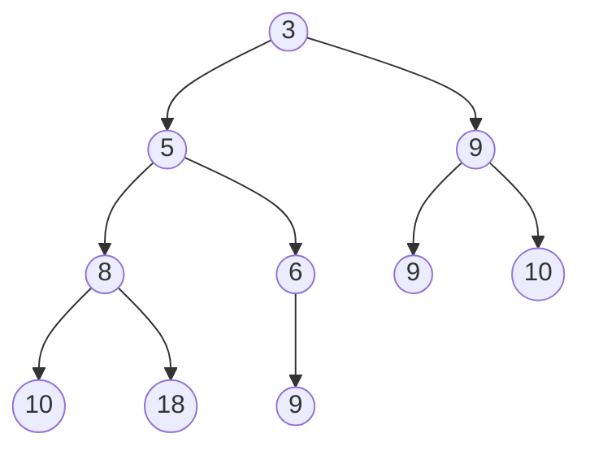
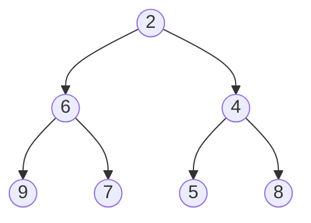
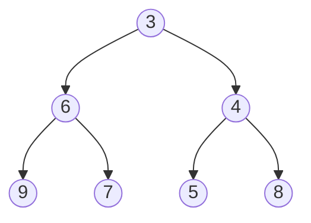

> [!goal] By the end of this note you can
> - List the four characteristics of a POT and check whether a given tree is one.
> - Trace **insert** (bubble up) and **deletemin** (push down) on a tree by hand.
> - Explain why deletemin swaps with the *smaller* child, and why both operations are O(log n).

## 1. The four characteristics

From your handout, a **partially ordered tree** is:

1. **A binary tree.** Each node has a left child, a right child, both, or neither.
2. **Balanced.** Its height is the minimum possible for its number of nodes.
3. **Filled left to right.** At the lowest level, any missing leaves are to the **right** of all the leaves that are present.
4. **POT property.** `P(parent) ≤ P(children)`, for every parent.

Properties 1–3 together describe what's usually called a **complete binary tree**. Property 4 is the "partially ordered" part.

The illustration from your slides:



## 2. What "partially" ordered means

The POT property only relates a parent to its **own children**. It says nothing about:

- **siblings:** 5 and 9 can appear in either order;
- **cousins:** the 18 on the left can be bigger than the 10 on the right;
- **levels:** a node deep on the left (9) can be smaller than a node higher on the right (10).

So a POT is **not sorted**, and you can't binary-search it. It guarantees exactly one thing, the one a priority queue needs: **the root is the minimum**. Every path from the root down is non-decreasing, so nothing can be smaller than the top.

That's also why it's cheap to maintain. Being *fully* sorted would cost O(n) per insert, while being *partially* ordered costs only O(log n).

## 3. Height is logarithmic

A balanced binary tree with n nodes has height ⌊log₂ n⌋:

| Nodes n | 1 | 3 | 7 | 15 | 1,000 | 1,000,000 |
|---|---|---|---|---|---|---|
| Height | 0 | 1 | 2 | 3 | 9 | 19 |

Insert and deletemin each walk **one root-to-leaf path**, so both are O(log n). A million elements take at most about 20 swaps.

## 4. Insert: add at the bottom, bubble up

From your handout:

```text
1. Place x at the lowest level, just right of the leaves present
   (or start the next level if the current one is full).
2. while (x is not the root and P(parent) > P(x)):
       SWAP(parent, x)
```

Step 1 keeps the shape valid (properties 1–3). Step 2 repairs property 4 along one path.

### Trace: insert 3

Start:



| Step | What happens | Check |
|---|---|---|
| 1 | The bottom level is full, so 3 starts a new level as the **left child of 9** | 9 > 3: POT broken |
| 2 | swap 3 and 9 | 3's parent is now 6; 6 > 3: still broken |
| 3 | swap 3 and 6 | 3's parent is now 2; 2 ≤ 3: **done** |

Result:



```mermaid
graph TD
  a((2)) --> b((3))
  a --> c((4))
  b --> d((6))
  b --> e((7))
  c --> f((5))
  c --> g((8))
  d --> h((9))
  classDef moved fill:#1c2140,stroke:#8b9cff,stroke-width:2px
  class b moved
```

Two swaps: exactly the height of the path the new element climbed.

## 5. Deletemin: take the root, refill from the bottom, push down

Removing the root would leave two separate trees (your slides: *"A forest!"*). So:

```text
1. min = root
2. Replace the root with the element X found at the lowest level, far right.
   Remove that last node.
3. while (X is not a leaf and the POT property fails at X):
       SChild = the smaller child of X
       SWAP(X, SChild)
4. return min
```

### Trace: deletemin on the result above

| Step | What happens | Tree (level by level) |
|---|---|---|
| 1 | min = **2** | |
| 2 | the last node (9) moves to the root | 9 / 3 4 / 6 7 5 8 |
| 3 | children of 9 are 3 and 4. The smaller is **3**, so swap | 3 / 9 4 / 6 7 5 8 |
| 4 | children of 9 are 6 and 7. The smaller is **6**, so swap | 3 / 6 4 / 9 7 5 8 |
| 5 | 9 is a leaf: **done**. Return 2 | |

Result:



### Why the *smaller* child?

At step 3, suppose we'd swapped 9 with the **larger** child, 4:

```text
      4
    /   \
   3     9      ← 4 is now the parent of 3, and 4 > 3: broken
```

The new parent must be ≤ **both** children, and only the smaller child satisfies that. Your slides spell it out: *"Swap 6 with its smallest child!"*

## 6. Practice

**Basic.** Which are POTs? Trees are given level by level, left to right.

```text
(a) 1 / 4 2 / 7 5 3        (b) 1 / 4 2 / 3 5 6
(c) 2 / 5 3 / 6 7 _ 4      (d) 5 / 5 6 / 5
```

> [!answer]- Answers
> (a) **POT**: 1 ≤ 4, 2; 4 ≤ 7, 5; 2 ≤ 3.
> (b) **Not a POT**: 4 > 3 (parent 4, child 3).
> (c) **Not a POT**: the order is fine, but the lowest level has a gap (`_`) with a leaf to its right. That breaks characteristic 3.
> (d) **POT**: equal priorities are allowed (≤), and the single leaf is on the left.

**Intermediate.** Insert 1 into the POT `3 / 6 4 / 9 7 5 8`. Show every swap.

> [!answer]- Answer
> 1 becomes the left child of 9. Swap with 9 → `3 / 6 4 / 1 7 5 8 / 9`. Swap with 6 → `3 / 1 4 / 6 7 5 8 / 9`. Swap with 3 → `1 / 3 4 / 6 7 5 8 / 9`. 1 is now the root: done, after **3 swaps**, the full height.

**Intermediate.** Do deletemin twice on `1 / 3 4 / 6 7 5 8 / 9`. What's returned each time, and what's left?

> [!answer]- Answer
> First: return **1**, move 9 to the root. Swap with 3, then with 6 → `3 / 6 4 / 9 7 5 8`.
> Second: return **3**, move 8 to the root. Children 6 and 4: swap with 4. Children 5 (and nothing else): swap with 5 → `4 / 6 5 / 9 7 8`.

**Advanced.** Where is the **maximum** element of a POT? And how many places could it be?

> [!answer]- Answer
> Always at a **leaf**: any internal node has a child that's ≥ it. In a POT with n nodes there are about n/2 leaves, so finding the max still costs O(n). A POT is built for the min, not the max.

**Advanced.** Why does insert put the new element at the *lowest level, far right*, and not somewhere smarter?

> [!hint]- Hint
> What would happen to characteristics 2 and 3 (balanced, filled left to right) if you put it anywhere else? And think ahead: the next note stores this tree in an **array**. What does "lowest level, far right" become in array terms?

## Next

A POT doesn't need pointers at all: store it level by level in an array. [[Heaps in Arrays]].

## References

- Course handout: *CIS 2101 Priority Queue*, slides 5–17 (POT illustration, characteristics, insert and deletemin steps)
- Aho, Hopcroft & Ullman, *Data Structures and Algorithms*, §4.11 (partially ordered tree implementation of priority queues)
- [Binary heap (Wikipedia)](https://en.wikipedia.org/wiki/Binary_heap)
