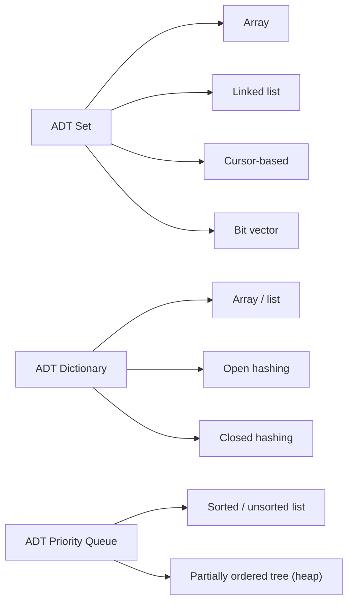

> [!goal] By the end of this note you can
> - Explain the difference between an ADT, a data structure, and an implementation.
> - Read an ADT specification the way your handouts write it: `insert(x, A)`, `member(x, A)`, …
> - Split an ADT into a C interface (prototypes) and an implementation (function bodies).

## The idea in one sentence

An **abstract data type (ADT)** is a mathematical model (a set of values) together with the **operations** you're allowed to perform on it. It says *what* each operation does and nothing about *how*.

A TV remote is a good mental model. You know what "volume up" does. You don't know, or need to know, whether the remote uses infrared, Bluetooth, or carrier pigeons. The buttons are the **interface**; the electronics are the **implementation**. You can swap the electronics without re-teaching anyone how to use the remote.

## Three words that get mixed up

| Term | Question it answers | Example |
|---|---|---|
| **ADT** | *What* values and operations exist? | "A set of integers with union, intersection, member" |
| **Data structure** | *How* is it laid out in memory? | an array, a linked list, a bit vector, a hash table |
| **Implementation** | The actual code | `void insert(Set *A, int x) { … }` |

One ADT can have many data structures behind it. That's the whole shape of this course:



You pick the data structure based on which operations you need to be fast. That trade-off is the skill this course is really teaching.

## How your course writes an ADT

The handouts follow Aho, Hopcroft & Ullman's *Data Structures and Algorithms*. Operations are written in math style: the element first, then the set.

| Operation | Meaning |
|---|---|
| `initialize(A)` | make `A` a valid, empty set |
| `makenull(A)` | empty an existing set |
| `insert(x, A)` | add `x` to `A` if it isn't already there |
| `delete(x, A)` | remove `x` from `A` if it's there |
| `member(x, A)` | true if `x ∈ A`, false otherwise |

Notice what's **not** there: no arrays, no pointers, no `count`. That's the "abstract" part. Anyone who uses the ADT only needs this table.

## From specification to C

In C, the interface lives in a header file (prototypes) and the implementation in a `.c` file (bodies). Code that *uses* the ADT only includes the header.

Here's a complete example on a small ADT that isn't part of your coursework: a **Fraction**.

```c title="fraction.h"
#ifndef FRACTION_H
#define FRACTION_H

typedef struct {
    int num;   /* numerator */
    int den;   /* denominator, always > 0 */
} Fraction;

Fraction makeFraction(int num, int den);   /* reduced, sign on the numerator */
Fraction addFraction(Fraction a, Fraction b);
int      equalFraction(Fraction a, Fraction b);
void     printFraction(Fraction f);

#endif
```

```c title="fraction.c" {4-8}
#include <stdio.h>
#include "fraction.h"

static int gcd(int a, int b) {        /* helper: hidden from users */
    if (a < 0) a = -a;
    if (b < 0) b = -b;
    while (b != 0) { int t = a % b; a = b; b = t; }
    return a;
}

Fraction makeFraction(int num, int den) {
    if (den < 0) { num = -num; den = -den; }
    int g = gcd(num, den);
    if (g == 0) g = 1;
    Fraction f = { num / g, den / g };
    return f;
}

Fraction addFraction(Fraction a, Fraction b) {
    return makeFraction(a.num * b.den + b.num * a.den, a.den * b.den);
}

int equalFraction(Fraction a, Fraction b) {
    return a.num == b.num && a.den == b.den;   /* works because both are reduced */
}

void printFraction(Fraction f) {
    printf("%d/%d\n", f.num, f.den);
}
```

```c title="main.c"
#include "fraction.h"

int main(void) {
    Fraction half = makeFraction(1, 2);
    Fraction third = makeFraction(2, 6);        /* stored as 1/3 */
    printFraction(addFraction(half, third));    /* 5/6 */
    return 0;
}
```

`main.c` never touches `gcd`, never reduces anything by hand, and would keep working if you changed `Fraction` to store a `double`. That's the payoff of an ADT: **the implementation can change without breaking the users**.

## C patterns you'll see in every ADT

**Modify → pass a pointer. Query → pass by value (or pointer to const).**

```c
void insert(Set *A, int x);     /* changes A, so it needs A's address   */
int  member(Set A, int x);      /* only reads A, a copy is fine         */
```

If `insert` took `Set A` by value, it would modify a *copy* and the caller's set would never change. This is the same reason your linked-list insert needed a `Node **`.

> [!warning] Arrays are the exception
> An array parameter decays to a pointer. `void f(int arr[])` can already modify the caller's array. So when a set **is** an array (`typedef bool Set[8];`), `insert(Set A, int x)` works without `*`. Look out for this in the bit-vector variations.

**Different `typedef` shapes for the same ADT.** Your List unit had four array versions: a struct, a pointer to a struct, a struct with a dynamic array, and a pointer to that. They're all the same ADT. Only the declarations and the `.` versus `->` access change.

## Practice

**Basic.**

1. Which of these belong in an ADT *specification*, and which belong to an *implementation*?
   `member(x, A)`, `A->count`, "returns true if x is in A", `malloc`, "inserting an existing element leaves A unchanged".

> [!answer]- Answer
> Specification: `member(x, A)`, "returns true if x is in A", "inserting an existing element leaves A unchanged".
> Implementation: `A->count` and `malloc`. They describe *how* the set is stored.

2. Why does `void insert(Set A, int x)` fail to change the caller's set when `Set` is a struct?

> [!answer]- Answer
> C passes structs by value. The function gets a copy and modifies the copy, which disappears when it returns. Pass `Set *A` and use `A->…` instead.

**Intermediate.**

3. You're given `typedef struct node { int elem; struct node *next; } *Set;`. Should `insert` take `Set` or `Set *`? Think about inserting into an **empty** set.

> [!hint]- Hint
> An empty set here is `NULL`. After inserting the first element, the caller's variable must point at a new node. Can a function change the caller's pointer if it only receives a copy of it?

**Advanced.**

4. Add `subtractFraction` and `lessThan` to the Fraction ADT without changing `main.c`'s existing lines. Which files change?

> [!answer]- Answer
> `fraction.h` (two new prototypes) and `fraction.c` (two new bodies). `main.c` only changes if it wants to *use* the new operations. That's the ADT boundary doing its job.

## Next

Before comparing implementations you need a way to measure them. That's [[Big-O and Complexity]].

## References

- Aho, Hopcroft & Ullman, *Data Structures and Algorithms* (1983), ch. 1: the source of your handouts' ADT notation.
- Course handout: `01 ADT Guide.pdf`
- [Abstract data type (Wikipedia)](https://en.wikipedia.org/wiki/Abstract_data_type)
