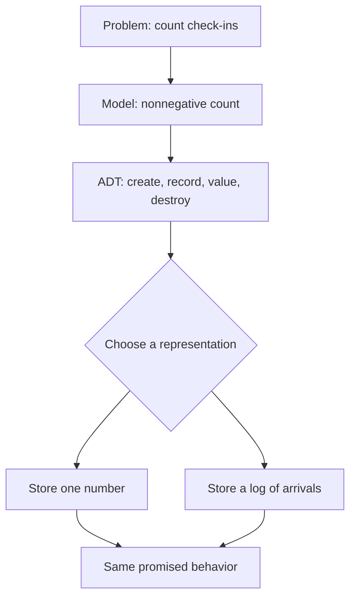

> [!goal] After this lesson
> You can distinguish a model, ADT, data structure, and implementation; write an operation contract; and explain why hiding a representation matters in C.

## 1. Start with a problem, not a struct

Imagine a campus event desk. It must **record each check-in** and **report how many people have arrived**. The user of this feature should not need to know whether the program stores one number or keeps an event log.

This follows Aho, Hopcroft, and Ullman's path from **problem → model → operations → implementation**. In §1.1 they refine an informal solution until its operations are precise enough to code; in §1.2 they define an abstract data type (ADT) as a mathematical model *together with operations*.



**The model alone is not the ADT.** A count with only `record` and `value` is a different ADT from one that also supports `undo` or `history`. Aho stresses that the *chosen operations* influence which representation is appropriate (Chapter 1 §1.2, supplied PDF p. 15).

> [!question]- Predict before reading on
> If the desk suddenly needs the ID of the last person who checked in, can one count answer? No: the requirement changes what the ADT must remember. A log, or at least the last ID, is now needed.

## 2. Four layers that sound alike

| Layer | Question | Check-in example |
|---|---|---|
| **Problem** | What outcome is needed? | Count arrivals. |
| **Model** | What values represent state? | A nonnegative integer. |
| **ADT** | Which operations and behavior are promised? | Record one arrival; read the count. |
| **Data structure / implementation** | How is state stored and manipulated? | A `size_t` field plus C functions, or a log. |

Aho's §1.3 describes arrays, records, linked cells, pointers, and cursors as **data structures**. A C `typedef` by itself is not an ADT specification.

## 3. Write a contract before code

| Operation | Precondition | Observable result |
|---|---|---|
| `create()` | None | New counter with value 0; may report allocation failure. |
| `record(c)` | `c` is valid | Adds 1, or reports overflow without changing the value. |
| `value(c)` | `c` is valid | Returns the count without changing it. |
| `destroy(c)` | `c` is valid or `NULL` | Releases its storage; the old pointer must not be used. |

**Invariant:** the value equals the number of *successful* `record` calls since creation. The contract does not promise a particular field name or allocation layout. Aho's SET example likewise names `MAKENULL(A)`, `UNION(A,B,C)`, and `SIZE(A)` without specifying an array or list (§1.2, PDF p. 15).

> [!important] A real boundary hides the representation
> If a public C header exposes a struct's fields and clients read them, changing those fields can break clients. The earlier Fraction example in this note exposed `num` and `den`; it did **not** guarantee that changing the storage to a `double` would leave every client unchanged.

## 4. Build the boundary in C

This original **check-in counter** is separate from the course's Set/List exercises. Save these blocks as three files in the same directory. The header declares an *incomplete* `struct Counter`, so client code can hold a `Counter *` but cannot access its fields.

```c title="counter.h"
#ifndef COUNTER_H
#define COUNTER_H
#include <stdbool.h>
#include <stddef.h>

typedef struct Counter Counter;       /* representation hidden */
Counter *counter_create(void);        /* NULL means allocation failed */
bool counter_record(Counter *c);      /* false if count would overflow */
size_t counter_value(const Counter *c);
void counter_destroy(Counter *c);
#endif
```

```c title="counter.c"
#include "counter.h"
#include <stdint.h>                 /* SIZE_MAX */
#include <stdlib.h>

struct Counter {
    size_t total;                  /* private representation */
};

Counter *counter_create(void) {
    Counter *c = malloc(sizeof *c);
    if (c != NULL) c->total = 0;
    return c;
}

bool counter_record(Counter *c) {
    if (c->total == SIZE_MAX) return false;
    ++c->total;
    return true;
}

size_t counter_value(const Counter *c) { return c->total; }
void counter_destroy(Counter *c) { free(c); }
```

```c title="main.c"
#include "counter.h"
#include <stdio.h>

int main(void) {
    Counter *desk = counter_create();
    if (desk == NULL) return 1;

    if (!counter_record(desk) || !counter_record(desk)) {
        counter_destroy(desk);
        return 1;
    }
    printf("arrivals: %zu\n", counter_value(desk)); /* arrivals: 2 */
    counter_destroy(desk);
    return 0;
}
```

From that directory, run:

```bash
cc -std=c11 -Wall -Wextra -Wpedantic counter.c main.c -o checkins
./checkins
```

Now try `desk->total = 99;` in `main.c`. The compiler rejects it: the client cannot see the private struct definition. A future implementation could keep a log and count its entries in `counter_value`; `main.c` would still compile, though costs and memory would change.

| Call | Private state | Client sees |
|---|---:|---|
| `create()` | `total = 0` | A valid handle. |
| `record()` | `total = 1` | `true`. |
| `record()` | `total = 2` | `true`. |
| `value()` | Still `2`. | `2`. |

## 5. Choose a representation deliberately

For *only* count and read, one number is simple. For the ID or time of each arrival, a log is useful. For the most recent 100 arrivals, a bounded ring buffer may fit. No representation wins without a workload.

Use this sequence for every course ADT:

1. **Name the values and operations.** What must users be able to ask or change?
2. **State preconditions and invariants.** What state must never become invalid?
3. **List representations.** Array, list, bit vector, hash table, heap, etc.
4. **Cost the important operations.** How often are they called? At what size?
5. **Test edges.** Empty, full, repeated element, invalid input, allocation failure.

## 6. Check your reasoning

**Classify** each statement as a promise to clients or a private detail: (a) `record` adds one or reports failure unchanged; (b) the count lives in a `size_t total` field; (c) `value` does not modify the count; (d) `malloc` allocates the object.

> [!answer]- Check
> (a) and (c) are client-visible behavior. (b) and (d) describe this implementation. Depending on (b) or (d) makes a representation change harder.

**Predict:** What new operation would force the counter to remember *more* than its current value? Sketch the smallest extra state you would need.

> [!hint]- One direction
> "Tell me the last arrival's ID" cannot be answered from a count. At minimum, retain that ID. Undoing an arbitrary arrival may require a history.

**Transfer:** Does Aho's `UNION(A,B,C)` contract say whether sets are arrays, lists, or bit vectors? What information would you ask for before choosing?

> [!answer]- Check
> It does not choose a representation. Ask about the possible element values, universe size, typical set size, and frequency of each operation. [[Big-O and Complexity]] supplies the language for those costs.

## Next

Learn to count work and compare implementations in [[Big-O and Complexity]].

## Source map

- Aho, Hopcroft & Ullman, *Data Structures and Algorithms* (1983), Chapter 1 §§1.1–1.3: problem-to-program refinement, the definition of an ADT, and data types versus data structures (supplied PDF pp. 5–18). The book uses Pascal; the C counter is an original teaching example.
- Same book, Chapter 4 §4.3: one SET ADT represented by a bit vector (PDF pp. 140–143).
